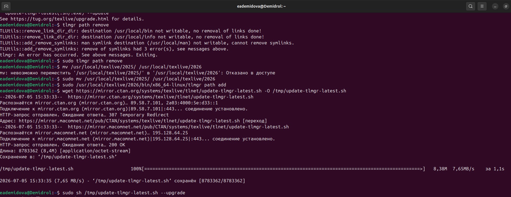

---
## Author
author:
  name: Демидова Екатерина Алексеевна
  degrees: BSc
  orcid: 0000-0002-0877-7063
  email: 1032259377@rudn.ru
  affiliation:
    - name: Российский университет дружбы народов
      country: Российская Федерация
      postal-code: 117198
      city: Москва
      address: ул. Миклухо-Маклая, д. 6
## Title
title: "Лабораторная работа №1"
subtitle: "LaTeX basics"
license: "CC BY"
date: today
date-format: "YYYY-MM-DD" # Example: 2025-09-06
---

# Вводная часть

## Цели и задачи

В ходе лабораторной работы требовалось установить и обновить установленную систему TeX Live.

# Ход выполнения работы

## Подготовка к обновлению

Перед обновлением были удалены старые символические ссылки, чтобы избежать конфликтов:

```bash
sudo /usr/local/texlive/2023/bin/x86_64-linux/tlmgr path remove
```

## Скачивание и запуск скрипта обновления

Скрипт был загружен с официального зеркала:

```bash
wget https://mirror.ctan.org/systems/texlive/tlnet/update-tlmgr-latest.sh 
                                            -O /tmp/update-tlmgr-latest.sh
```

Запуск скрипта с правильным флагом:

```bash
sudo sh /tmp/update-tlmgr-latest.sh -- --upgrade
```

## Скачивание и запуск скрипта обновления

{#fig-001 width=70%}

## Обновление всех пакетов

После успешного обновления `tlmgr` была выполнена команда обновления всех пакетов до актуальных версий:

```bash
sudo /usr/local/texlive/2026/bin/x86_64-linux/tlmgr update --self --all
```

## Создание глобальных символических ссылок и настройка кэша LuaLaTeX

```bash
sudo /usr/local/texlive/2026/bin/x86_64-linux/tlmgr path add
```

Для ускорения работы LuaLaTeX был перенесён кэш шрифтов из старой версии:

```bash
mv ~/.texlive2023 ~/.texlive2026
luaotfload-tool -fu
```

## Проверка итоговой версии

Была проверена версия установленного TeX Live:

```bash
tex --version
```

Результат: `TeX 3.141592653 (TeX Live 2026)`. Обновление прошло успешно.

## Проверка итоговой версии

{#fig-002 width=70%}

# Выводы

В ходе лабораторной работы были получены практические навыки обновления TeX Live с переходом через несколько мажорных версий. Были использованы официальные средства (`update-tlmgr-latest.sh`), а также освоены команды:

- `tlmgr update --self` – обновление менеджера пакетов;
- `tlmgr update --all` – обновление всех установленных пакетов;
- `tlmgr path add/remove` – управление символическими ссылками;
- `luaotfload-tool -fu` – обновление кэша шрифтов.

# Список литературы

1. American Mathematical Society. Why Do We Recommend LaTeX? — URL: https://www.ams.org/publications/authors/tex/latexbenefits ; Рекомендации AMS по использованию LaTeX2e. AMS Publications.
2. Lamport L. LaTeX: A Document Preparation System. — 1986. — Первое руководство по LaTeX.
3. LaTeX Project. An introduction to LaTeX. — URL: https://www.latex-project.org/about/ ; Дата обращения: 05.07.2026. Официальный сайт LaTeX.
4. Wikipedia. LaTeX. — URL: https://en.wikipedia.org/wiki/LaTeX ; Общая информация о системе LaTeX. Wikipedia, The Free Encyclopedia.