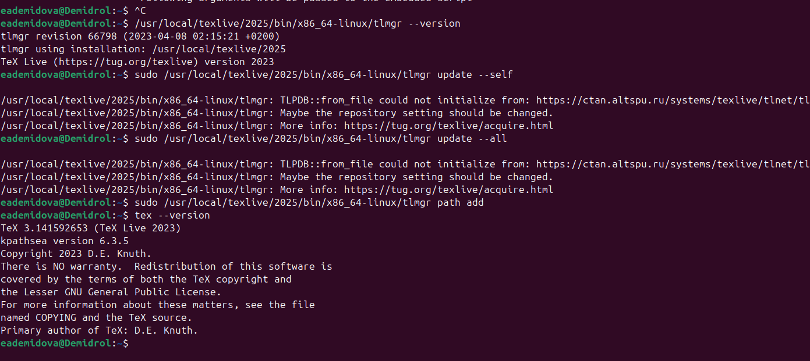

---
## Author
author:
  name: Демидова Екатерина Алексеевна
  degrees: BSc
  orcid: 0000-0002-0877-7063
  email: 1032259377@rudn.ru
  affiliation:
    - name: Российский университет дружбы народов
      country: Российская Федерация
      postal-code: 117198
      city: Москва
      address: ул. Миклухо-Маклая, д. 6

## Title
title: "Лабораторная работа №1"
subtitle: "LaTeX basics"
license: "CC BY"
---

# Цель работы

В ходе лабораторной работы требовалось установить и обновить установленную систему TeX Live.

# Задание

Установить и обновить TeX Live.

# Теоретическое введение

**LaTeX** — это система подготовки документов высокого типографского качества, построенная на основе языка разметки TeX. В отличие от текстовых процессоров (WYSIWYG), LaTeX использует описательную разметку: автор пишет текстовый файл с командами, определяющими структуру документа, а затем запускает компиляцию для получения готового PDF или DVI. Такой подход обеспечивает разделение содержания и оформления, позволяя сосредоточиться на логике документа, а не на его внешнем виде [@latex_project_intro].

LaTeX был разработан в начале 1980‑х годов **Лесли Лампортом** (Leslie Lamport) в SRI International. Лампорт создал набор макросов для TeX, который затем вырос в полноценную систему. В 1986 году вышло первое руководство пользователя, быстро ставшее популярным. С 1989 года развитие LaTeX перешло к команде под руководством Франка Миттельбаха, а в 1994 году была выпущена стабильная версия **LaTeX2e**, которая используется и сегодня [@lamport_latex_1986; @wikipedia_latex].

Главный принцип LaTeX — **логическая разметка**: автор использует команды типа `\chapter`, `\section`, `\table`, `\figure`, а система сама определяет, как эти элементы должны выглядеть в финальном документе. Это избавляет автора от ручного форматирования и делает документ единообразным. Кроме того, LaTeX обеспечивает автоматическую генерацию оглавлений, списков иллюстраций, перекрёстных ссылок и библиографий, что особенно важно для больших научных работ [@ams_latex_benefits].

Среди основных достоинств LaTeX выделяют:

- **стабильность и предсказуемость** вёрстки;
- **высокое качество** математических формул и типографики;
- **поддержка** крупных проектов с множеством файлов;
- **лёгкость** обмена и совместной работы (исходные файлы — обычный текст);
- **обширная экосистема** пакетов, расширяющих функциональность [@latex_project_intro; @ams_latex_benefits].

Американское математическое общество (AMS) рекомендует LaTeX для подготовки математических публикаций именно благодаря этим качествам [@ams_latex_benefits].

LaTeX широко используется в академической среде — для статей, диссертаций, книг, презентаций, а также в технической документации. Благодаря модульности он остаётся актуальным и сегодня, постоянно обновляясь (последние версии выходят ежегодно). Подробнее об истории и возможностях системы можно прочитать в открытых источниках [@wikipedia_latex].

# Ход выполнения работы

Перед обновлением были удалены старые символические ссылки, чтобы избежать конфликтов:

```bash
sudo /usr/local/texlive/2023/bin/x86_64-linux/tlmgr path remove
```

Скрипт был загружен с официального зеркала:

```bash
wget https://mirror.ctan.org/systems/texlive/tlnet/update-tlmgr-latest.sh 
                                          -O /tmp/update-tlmgr-latest.sh
```

Запуск скрипта с правильным флагом([рис. @fig-001]):

```bash
sudo sh /tmp/update-tlmgr-latest.sh -- --upgrade
```

{#fig-001 width=70%}

После успешного обновления `tlmgr` была выполнена команда обновления всех пакетов до актуальных версий:

```bash
sudo /usr/local/texlive/2026/bin/x86_64-linux/tlmgr update --self --all
```

```bash
sudo /usr/local/texlive/2026/bin/x86_64-linux/tlmgr path add
```

Для ускорения работы LuaLaTeX был перенесён кэш шрифтов из старой версии:

```bash
mv ~/.texlive2023 ~/.texlive2026
luaotfload-tool -fu
```

Была проверена версия установленного TeX Live:

```bash
tex --version
```

Результат: `TeX 3.141592653 (TeX Live 2026)`. Обновление прошло успешно.

На [рис. @fig-002] представлены основные команды управления `tlmgr`, использованные в работе.

{#fig-002 width=70%}

---

# Выводы

В ходе лабораторной работы были получены практические навыки обновления TeX Live с переходом через несколько мажорных версий. Были использованы официальные средства (`update-tlmgr-latest.sh`), а также освоены команды:

- `tlmgr update --self` – обновление менеджера пакетов;
- `tlmgr update --all` – обновление всех установленных пакетов;
- `tlmgr path add/remove` – управление символическими ссылками;
- `luaotfload-tool -fu` – обновление кэша шрифтов.

# Список литературы{.unnumbered}

::: {#refs}
:::
