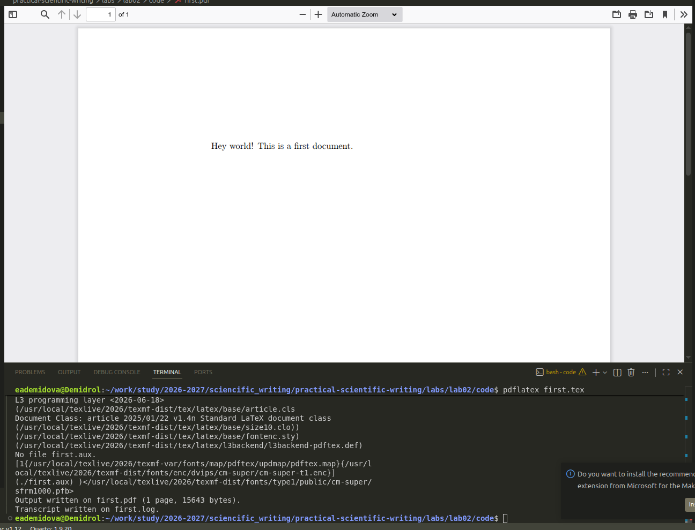
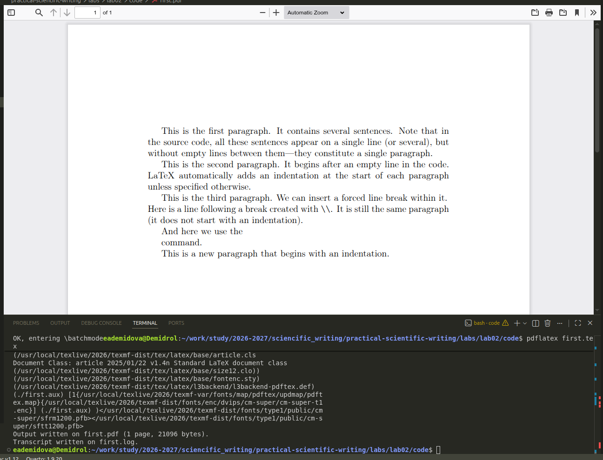
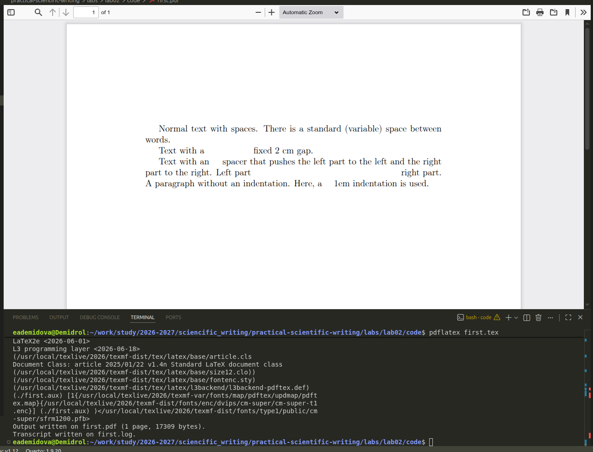
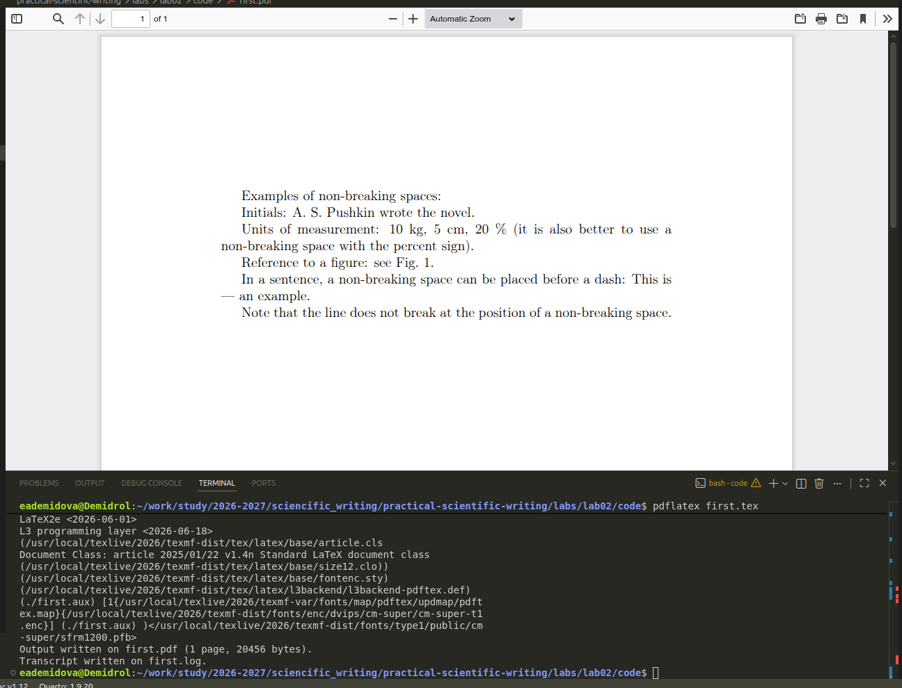

---
## Author
author:
  name: Демидова Екатерина Алексеевна
  degrees: BSc
  orcid: 0000-0002-0877-7063
  email: 1032259377@rudn.ru
  affiliation:
    - name: Российский университет дружбы народов
      country: Российская Федерация
      postal-code: 117198
      city: Москва
      address: ул. Миклухо-Маклая, д. 6
## Title
title: "Лабораторная работа №2"
subtitle: "LaTeX document structure"
license: "CC BY"
date: today
date-format: "YYYY-MM-DD" # Example: 2025-09-06
---

# Вводная часть

## Цели и задачи

В ходе лабораторной работы требовалось изучить базовую структуру документа LaTex.

# Ход выполнения работы

## Базовый документ

{#fig-001 width=60%}

## Добавление текста и создание абзацев

{#fig-002 width=60%}

## Переменные пробелы и горизонтальные отступы

{#fig-003 width=60%}

## Жёсткие (неразрывные) пробелы

{#fig-004 width=60%}

# Выводы

В ходе выполнения лабораторной работы были освоены:

- создание абзацев и управление их разбивкой с помощью пустых строк, команд `\\`, `\newline`, `\par`;
- вставка горизонтальных и вертикальных пробелов (`\hspace`, `\hfill`, `\vspace`);
- использование жёстких пробелов (`~`) для предотвращения нежелательных переносов строк;

# Список литературы

1. American Mathematical Society. Why Do We Recommend LaTeX? — URL: https://www.ams.org/publications/authors/tex/latexbenefits ; Рекомендации AMS по использованию LaTeX2e. AMS Publications.
2. Lamport L. LaTeX: A Document Preparation System. — 1986. — Первое руководство по LaTeX.
3. LaTeX Project. An introduction to LaTeX. — URL: https://www.latex-project.org/about/ ; Дата обращения: 05.07.2026. Официальный сайт LaTeX.
4. Wikipedia. LaTeX. — URL: https://en.wikipedia.org/wiki/LaTeX ; Общая информация о системе LaTeX. Wikipedia, The Free Encyclopedia.