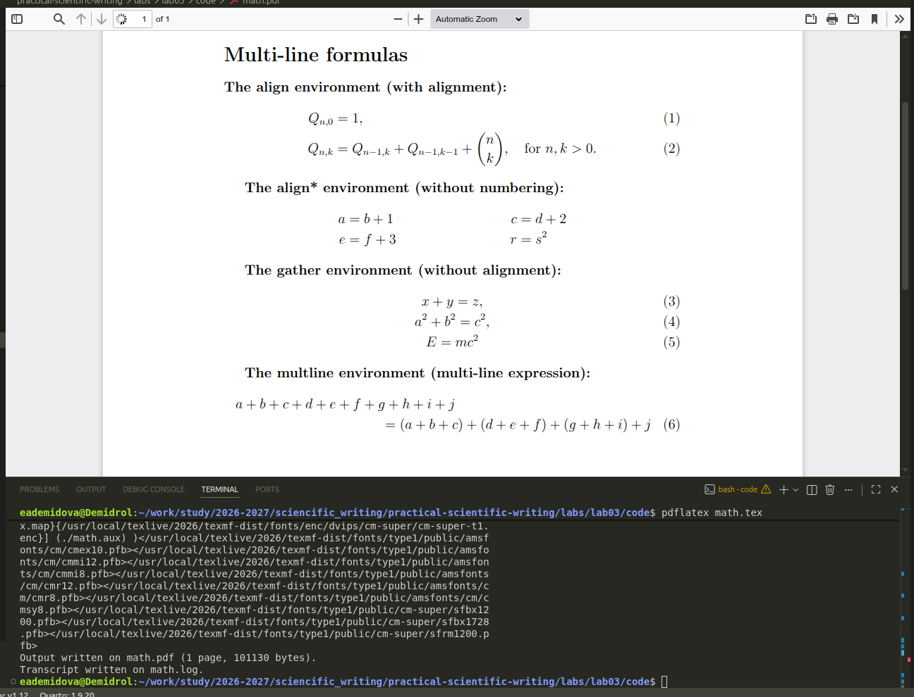

---
## Author
author:
  name: Демидова Екатерина Алексеевна
  degrees: BSc
  orcid: 0000-0002-0877-7063
  email: 1032259377@rudn.ru
  affiliation:
    - name: Российский университет дружбы народов
      country: Российская Федерация
      postal-code: 117198
      city: Москва
      address: ул. Миклухо-Маклая, д. 6
## Title
title: "Лабораторная работа №3"
subtitle: "Mathematics Typing"
license: "CC BY"
date: today
date-format: "YYYY-MM-DD" # Example: 2025-09-06
---

# Вводная часть

## Цели и задачи

В ходе лабораторной работы требовалось освоить базовые возможности математического набора в LaTeX, включая встроенные и выключные формулы, использование пакета amsmath, а также работу с различными шрифтами в математическом режиме.

1. Изучить основные режимы математического набора (inline и display).
2. Освоить набор superscripts и subscripts.
3. Изучить возможности пакета amsmath для многострочных формул.
4. Освоить изменение шрифтов в математическом режиме.
5. Изучить пакеты bm, mathtools и unicode-math.

# Ход выполнения работы

## Базовый математический режим

{#fig-01 width=60%}

## Superscripts и Subscripts

{#fig-02 width=60%}

## Пакет amsmath: многострочные формулы

{#fig-03 width=60%}

## Шрифты в математическом режиме

{#fig-04 width=60%}

## Пакеты bm и mathtools

{#fig-05 width=60%}

## Пакет unicode-math

{#fig-06 width=60%}

# Выводы

1. **Базовый математический набор**: встроенные и выключные формулы, использование разделителей `\(...\)` и `\[...\]`, а также окружения equation.
2. **Работа со степенями и индексами**: использование ^ и _ для верхних и нижних индексов, обязательное использование фигурных скобок для сложных выражений.
3. **Греческие буквы и стандартные функции**: команды для набора греческих букв ($\alpha$, $\beta$, $\pi$ и др.) и стандартных математических функций ($\sin$, $\cos$, $\log$).
4. **Пакет amsmath**: освоение окружений align, gather, multline для многострочных формул с возможностью нумерации и без.
5. **Шрифтовые команды**: использование `\mathrm`, `\mathbf`, `\mathsf`, `\mathtt`, `\mathit`, `\mathcal`, `\mathbb` для изменения начертания символов в математическом режиме, а также `\text{}` для вставки обычного текста.
6. **Специализированные пакеты**: работа с `\bm` для жирных символов (включая греческие буквы и операторы), а также mathtools для расширенных возможностей матриц.
7. **Современные возможности**: знакомство с пакетом unicode-math для использования OpenType математических шрифтов.

# Список литературы

1. American Mathematical Society. Why Do We Recommend LaTeX? — URL: https://www.ams.org/publications/authors/tex/latexbenefits ; Рекомендации AMS по использованию LaTeX2e. AMS Publications.
2. Lamport L. LaTeX: A Document Preparation System. — 1986. — Первое руководство по LaTeX.
3. LaTeX Project. An introduction to LaTeX. — URL: https://www.latex-project.org/about/ ; Дата обращения: 05.07.2026. Официальный сайт LaTeX.
4. Wikipedia. LaTeX. — URL: https://en.wikipedia.org/wiki/LaTeX ; Общая информация о системе LaTeX. Wikipedia, The Free Encyclopedia.