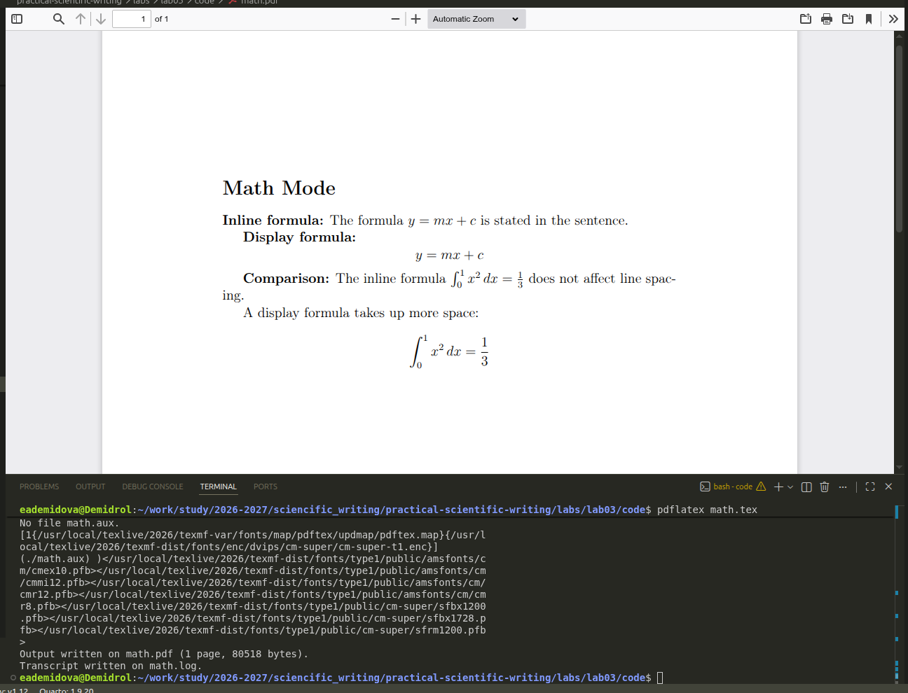
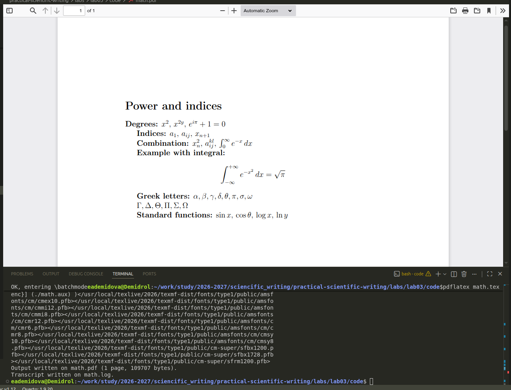
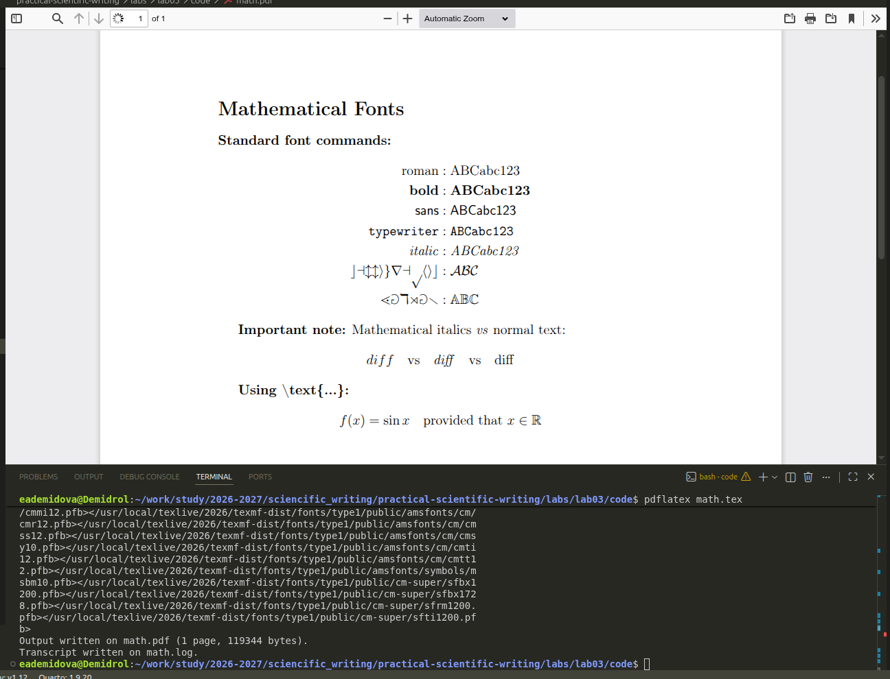
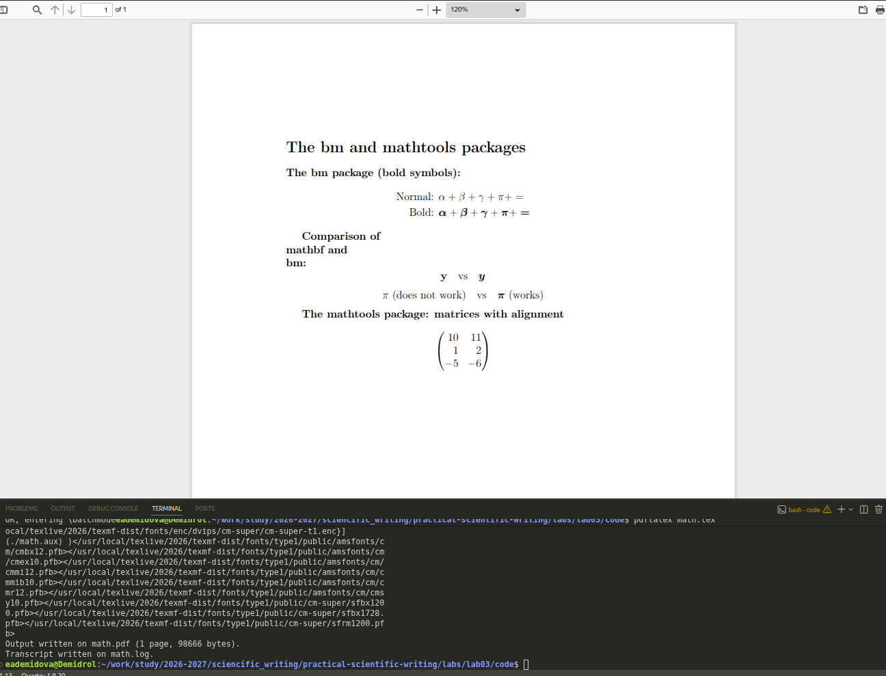
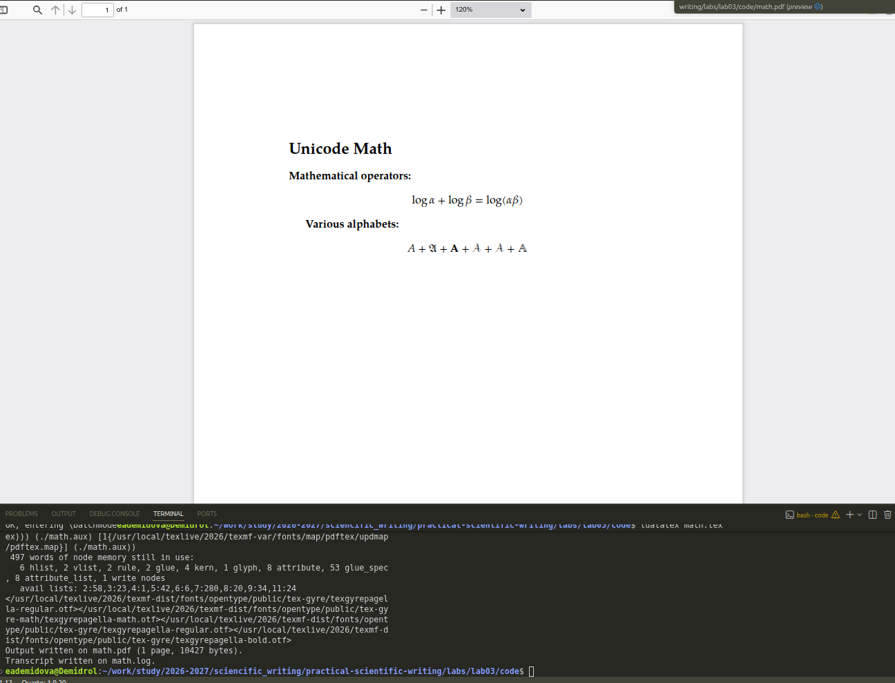

---
## Author
author:
  name: Демидова Екатерина Алексеевна
  degrees: BSc
  orcid: 0000-0002-0877-7063
  email: 1032259377@rudn.ru
  affiliation:
    - name: Российский университет дружбы народов
      country: Российская Федерация
      postal-code: 117198
      city: Москва
      address: ул. Миклухо-Маклая, д. 6

## Title
title: "Лабораторная работа №3"
subtitle: "Mathematics Typing"
license: "CC BY"
---

# Цель работы

В ходе лабораторной работы требовалось освоить базовые возможности математического набора в LaTeX, включая встроенные и выключные формулы, использование пакета amsmath, а также работу с различными шрифтами в математическом режиме.

# Задание

1. Изучить основные режимы математического набора (inline и display).
2. Освоить набор superscripts и subscripts.
3. Изучить возможности пакета amsmath для многострочных формул.
4. Освоить изменение шрифтов в математическом режиме.
5. Изучить пакеты bm, mathtools и unicode-math.

# Теоретическое введение

**LaTeX** — это система подготовки документов высокого типографского качества, построенная на основе языка разметки TeX. В отличие от текстовых процессоров (WYSIWYG), LaTeX использует описательную разметку: автор пишет текстовый файл с командами, определяющими структуру документа, а затем запускает компиляцию для получения готового PDF или DVI. Такой подход обеспечивает разделение содержания и оформления, позволяя сосредоточиться на логике документа, а не на его внешнем виде [@latex_project_intro].

LaTeX был разработан в начале 1980‑х годов **Лесли Лампортом** (Leslie Lamport) в SRI International. Лампорт создал набор макросов для TeX, который затем вырос в полноценную систему. В 1986 году вышло первое руководство пользователя, быстро ставшее популярным. С 1989 года развитие LaTeX перешло к команде под руководством Франка Миттельбаха, а в 1994 году была выпущена стабильная версия **LaTeX2e**, которая используется и сегодня [@lamport_latex_1986; @wikipedia_latex].

Главный принцип LaTeX — **логическая разметка**: автор использует команды типа `\chapter`, `\section`, `\table`, `\figure`, а система сама определяет, как эти элементы должны выглядеть в финальном документе. Это избавляет автора от ручного форматирования и делает документ единообразным. Кроме того, LaTeX обеспечивает автоматическую генерацию оглавлений, списков иллюстраций, перекрёстных ссылок и библиографий, что особенно важно для больших научных работ [@ams_latex_benefits].

Среди основных достоинств LaTeX выделяют:

- **стабильность и предсказуемость** вёрстки;
- **высокое качество** математических формул и типографики;
- **поддержка** крупных проектов с множеством файлов;
- **лёгкость** обмена и совместной работы (исходные файлы — обычный текст);
- **обширная экосистема** пакетов, расширяющих функциональность [@latex_project_intro; @ams_latex_benefits].

Американское математическое общество (AMS) рекомендует LaTeX для подготовки математических публикаций именно благодаря этим качествам [@ams_latex_benefits].

LaTeX широко используется в академической среде — для статей, диссертаций, книг, презентаций, а также в технической документации. Благодаря модульности он остаётся актуальным и сегодня, постоянно обновляясь (последние версии выходят ежегодно). Подробнее об истории и возможностях системы можно прочитать в открытых источниках [@wikipedia_latex].

# Ход выполнения работы

## Базовый математический режим

Создадим документ, демонстрирующий различия между встроенным и выключным режимами ([рис. @fig-01]):

```tex
\documentclass[a4paper,12pt]{article}
\usepackage[T1]{fontenc}
\usepackage{amsmath}
\begin{document}

\section*{Математический режим}

\textbf{Встроенная формула:} 
В предложении содержится формула \( y = mx + c \).

\textbf{Выключная формула:}
\[
y = mx + c
\]

\textbf{Сравнение:}
Встроенная формула \( \int_0^1 x^2 \, dx = \frac{1}{3} \) не нарушает межстрочный интервал.

Выключная формула занимает больше места:
\[
\int_0^1 x^2 \, dx = \frac{1}{3}
\]

\end{document}
```

{#fig-01 width=70%}

## Superscripts и Subscripts

Освоим набор верхних и нижних индексов ([рис. @fig-02]):

```tex
\documentclass[a4paper,12pt]{article}
\usepackage[T1]{fontenc}
\usepackage{amsmath}

\begin{document}

\section*{Степени и индексы}

\textbf{Степени:}
\( x^2 \), \( x^{2y} \), \( e^{i\pi} + 1 = 0 \)

\textbf{Индексы:}
\( a_1 \), \( a_{ij} \), \( x_{n+1} \)

\textbf{Совмещение:}
\( x_n^2 \), \( a_{ij}^{kl} \), \( \int_0^\infty e^{-x} \, dx \)

\textbf{Пример с интегралом:}
\[
\int_{-\infty}^{+\infty} e^{-x^2} \, dx = \sqrt{\pi}
\]

\textbf{Греческие буквы:}
\(\alpha, \beta, \gamma, \delta, \theta, \pi, \sigma, \omega\)

\(\Gamma, \Delta, \Theta, \Pi, \Sigma, \Omega\)

\textbf{Стандартные функции:}
\(\sin x\), \(\cos \theta\), \(\log x\), \(\ln y\)

\end{document}
```

{#fig-02 width=70%}

## Пакет amsmath: многострочные формулы

Изучим окружения align и gather для многострочных формул ([рис. @fig-03]):

```tex
\documentclass[a4paper,12pt]{article}
\usepackage[T1]{fontenc}
\usepackage{amsmath}

\begin{document}

\section*{Многострочные формулы}

\textbf{Окружение align (с выравниванием):}
\begin{align}
Q_{n,0} &= 1, \\
Q_{n,k} &= Q_{n-1,k} + Q_{n-1,k-1} + \binom{n}{k}, \quad \text{для } n, k > 0.
\end{align}

\textbf{Окружение align* (без нумерации):}
\begin{align*}
a &= b + 1 & c &= d + 2 \\
e &= f + 3 & r &= s^2
\end{align*}

\textbf{Окружение gather (без выравнивания):}
\begin{gather}
x + y = z, \\
a^2 + b^2 = c^2, \\
E = mc^2
\end{gather}

\textbf{Окружение multline (многострочное выражение):}
\begin{multline}
a + b + c + d + e + f + g + h + i + j \\
= (a + b + c) + (d + e + f) + (g + h + i) + j
\end{multline}

\end{document}
```

{#fig-03 width=70%}

## Шрифты в математическом режиме

Изучим различные шрифтовые команды ([рис. @fig-04]):

```tex
\documentclass[a4paper,12pt]{article}
\usepackage[T1]{fontenc}
\usepackage{amsmath}
\usepackage{amssymb}  % для \mathbb

\begin{document}

\section*{Шрифты в математике}

\textbf{Стандартные шрифтовые команды:}
\begin{align*}
\mathrm{roman} &: \mathrm{ABCabc123} \\
\mathbf{bold} &: \mathbf{ABCabc123} \\
\mathsf{sans} &: \mathsf{ABCabc123} \\
\mathtt{typewriter} &: \mathtt{ABCabc123} \\
\mathit{italic} &: \mathit{ABCabc123} \\
\mathcal{calligraphic} &: \mathcal{ABC} \\
\mathbb{blackboard} &: \mathbb{ABC}
\end{align*}

\textbf{Важное замечание:}
Математический курсив \textit{vs} обычный текст:
\[
diff \quad \text{vs} \quad \mathit{diff} \quad \text{vs} \quad \mathrm{diff}
\]

\textbf{Использование \textbackslash text\{...\}:}
\[
f(x) = \sin x \quad \text{при условии, что } x \in \mathbb{R}
\]

\end{document}
```

{#fig-04 width=70%}

## Пакеты bm и mathtools

Изучим возможности пакетов bm и mathtools ([рис. @fig-05]):

```tex
\documentclass[a4paper,12pt]{article}
\usepackage[T1]{fontenc}
\usepackage{amsmath}
\usepackage{bm}
\usepackage{mathtools}

\begin{document}

\section*{Пакеты bm и mathtools}

\textbf{Пакет bm (жирные символы):}
\begin{align*}
\text{Обычный: } & \alpha + \beta + \gamma + \pi + = \\
\text{Жирный: } & \bm{\alpha} + \bm{\beta} + \bm{\gamma} + \bm{\pi} + \bm{=}
\end{align*}

\textbf{Сравнение \mathbf и \bm:}
\[
\mathbf{y} \quad \text{vs} \quad \bm{y}
\]
\[
\mathbf{\pi} \text{ (не работает)} \quad \text{vs} \quad \bm{\pi} \text{ (работает)}
\]

\textbf{Пакет mathtools: матрицы с выравниванием}
\[
\begin{pmatrix*}[r]
10 & 11 \\
1 & 2 \\
-5 & -6
\end{pmatrix*}
\]

\end{document}
```

{#fig-05 width=70%}

## Пакет unicode-math

Пример использования пакета unicode-math (требуется компилятор LuaLaTeX) ([рис. @fig-06]):

```tex
% !TEX lualatex
\documentclass[a4paper,12pt]{article}
\usepackage{unicode-math}
\setmainfont{TeX Gyre Pagella}
\setmathfont{TeX Gyre Pagella Math}

\begin{document}

\section*{Unicode Math}

\textbf{Математические операторы:}
\[
\log \alpha + \log \beta = \log(\alpha\beta)
\]

\textbf{Различные алфавиты:}
\[
A + \symfrak{A} + \symbf{A} + \symcal{A} + \symscr{A} + \symbb{A}
\]

\end{document}
```

{#fig-06 width=70%}

# Выводы

В ходе выполнения лабораторной работы были освоены:

1. **Базовый математический набор**: встроенные и выключные формулы, использование разделителей `\(...\)` и `\[...\]`, а также окружения equation.
2. **Работа со степенями и индексами**: использование ^ и _ для верхних и нижних индексов, обязательное использование фигурных скобок для сложных выражений.
3. **Греческие буквы и стандартные функции**: команды для набора греческих букв ($\alpha$, $\beta$, $\pi$ и др.) и стандартных математических функций ($\sin$, $\cos$, $\log$).
4. **Пакет amsmath**: освоение окружений align, gather, multline для многострочных формул с возможностью нумерации и без.
5. **Шрифтовые команды**: использование `\mathrm`, `\mathbf`, `\mathsf`, `\mathtt`, `\mathit`, `\mathcal`, `\mathbb` для изменения начертания символов в математическом режиме, а также `\text{}` для вставки обычного текста.
6. **Специализированные пакеты**: работа с `\bm` для жирных символов (включая греческие буквы и операторы), а также mathtools для расширенных возможностей матриц.
7. **Современные возможности**: знакомство с пакетом unicode-math для использования OpenType математических шрифтов.

# Список литературы{.unnumbered}

::: {#refs}
:::
