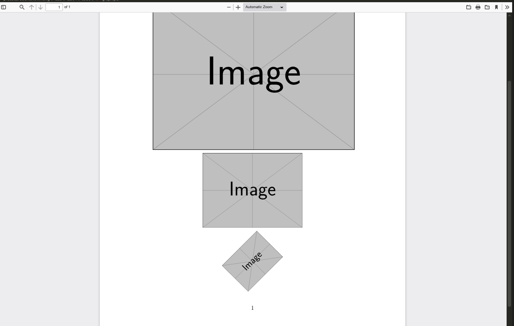
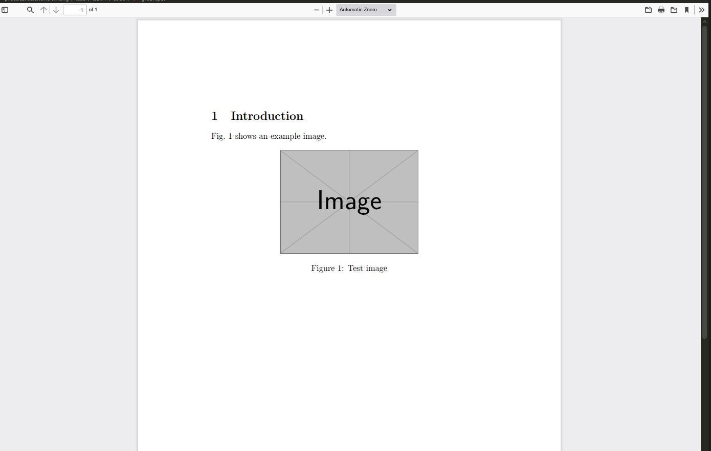
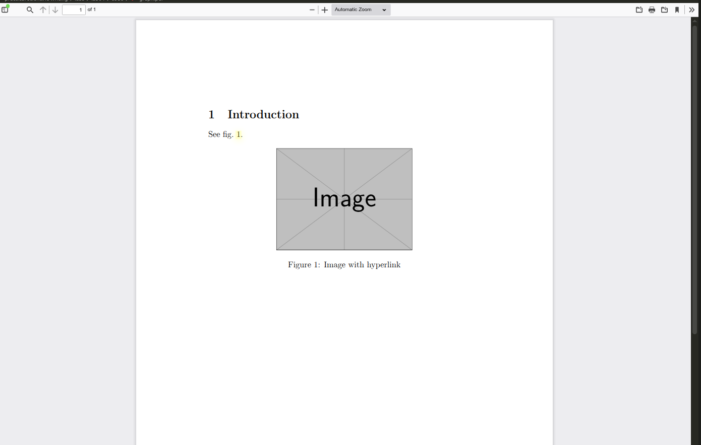

---
## Author
author:
  name: Демидова Екатерина Алексеевна
  degrees: BSc
  orcid: 0000-0002-0877-6063
  email: 1032259377@rudn.ru
  affiliation:
    - name: Российский университет дружбы народов
      country: Российская Федерация
      postal-code: 117198
      city: Москва
      address: ул. Миклухо-Маклая, д. 6
## Title
title: "Лабораторная работа №4"
subtitle: "Including Graphics"
license: "CC BY"
date: today
date-format: "YYYY-MM-DD" # Example: 2025-09-06
---

# Вводная часть

## Цели и задачи

В ходе лабораторной работы требовалось освоить включение внешних графических файлов в документы LaTeX, управление их размером и положением, использование плавающих окружений, а также создание перекрёстных ссылок на иллюстрации.

1. Изучить пакет `graphicx` и команду `\includegraphics`.
2. Освоить изменение размеров, масштабирование и поворот изображений.
3. Научиться создавать плавающие окружения `figure` и управлять их позиционированием.
4. Освоить механизм перекрёстных ссылок (`\label` и `\ref`) для рисунков.
5. Изучить использование пакета `hyperref` для создания гиперссылок.
6. Познакомиться с альтернативными способами создания графики (TikZ, Asymptote и др.).

# Ход выполнения работы

## Базовое включение графики

{#fig-01 width=60%}

## Настройка размера и поворота

{#fig-02 width=60%}

## Обрезка изображения

{#fig-03 width=60%}

## Плавающие окружения (float)

{#fig-04 width=60%}

## Управление позиционированием с помощью пакета float

![Абсолютное позиционирование с [H]](image/5.png){#fig-05 width=60%}

## Перекрёстные ссылки

{#fig-06 width=60%}

## Гиперссылки

{#fig-07 width=60%}

# Выводы

В ходе выполнения лабораторной работы были освоены:

- подключение пакета `graphicx` и использование команды `\includegraphics` для вставки изображений в форматах PDF, PNG, JPG;
- управление размером, масштабом, поворотом и обрезкой графики с помощью опций `width`, `height`, `scale`, `angle`, `trim`, `clip`;
- создание плавающих окружений `figure` с подписями (`\caption`) и управление их размещением с помощью спецификаторов `h`, `t`, `b`, `p`, а также опции `H` из пакета `float`;
- использование механизма перекрёстных ссылок `\label` и `\ref` для нумерованных иллюстраций;
- добавление гиперссылок с помощью пакета `hyperref`.

# Список литературы

1. American Mathematical Society. Why Do We Recommend LaTeX? — URL: https://www.ams.org/publications/authors/tex/latexbenefits ; Рекомендации AMS по использованию LaTeX2e. AMS Publications.
2. Lamport L. LaTeX: A Document Preparation System. — 1986. — Первое руководство по LaTeX.
3. LaTeX Project. An introduction to LaTeX. — URL: https://www.latex-project.org/about/ ; Дата обращения: 05.07.2026. Официальный сайт LaTeX.
4. Wikipedia. LaTeX. — URL: https://en.wikipedia.org/wiki/LaTeX ; Общая информация о системе LaTeX. Wikipedia, The Free Encyclopedia.