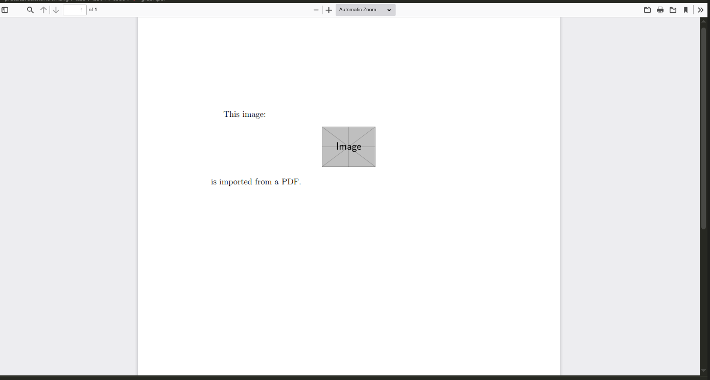
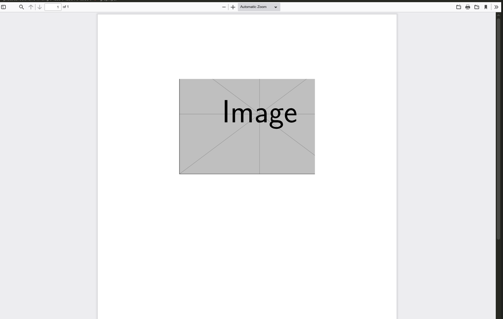
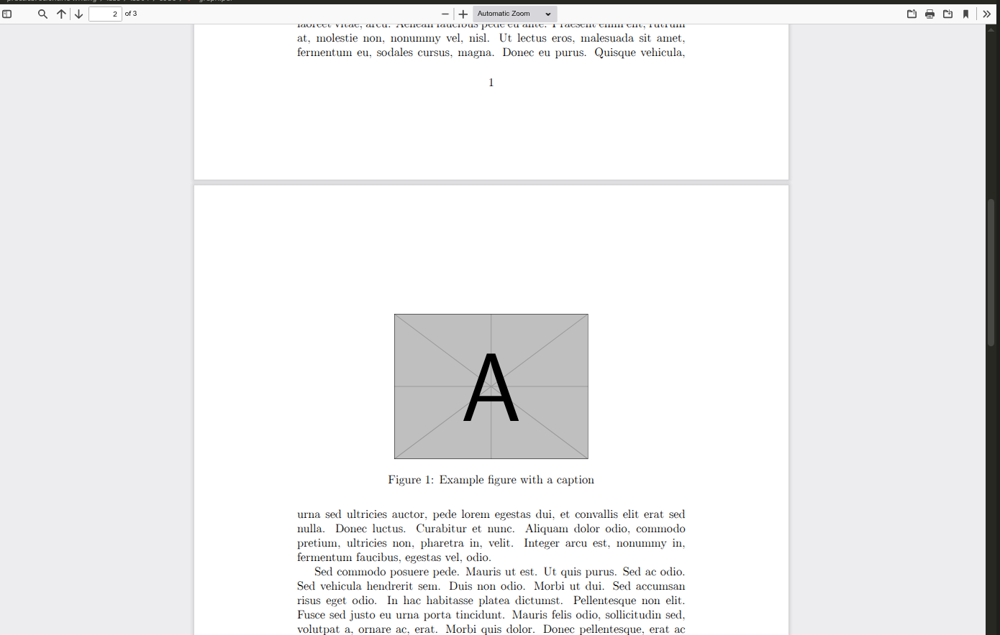

---
## Author
author:
  name: Демидова Екатерина Алексеевна
  degrees: BSc
  orcid: 0000-0002-0877-7063
  email: 1032259377@rudn.ru
  affiliation:
    - name: Российский университет дружбы народов
      country: Российская Федерация
      postal-code: 117198
      city: Москва
      address: ул. Миклухо-Маклая, д. 6

## Title
title: "Лабораторная работа №4"
subtitle: "Including Graphics"
license: "CC BY"
---

# Цель работы

В ходе лабораторной работы требовалось освоить включение внешних графических файлов в документы LaTeX, управление их размером и положением, использование плавающих окружений, а также создание перекрёстных ссылок на иллюстрации.

# Задание

1. Изучить пакет `graphicx` и команду `\includegraphics`.
2. Освоить изменение размеров, масштабирование и поворот изображений.
3. Научиться создавать плавающие окружения `figure` и управлять их позиционированием.
4. Освоить механизм перекрёстных ссылок (`\label` и `\ref`) для рисунков.
5. Изучить использование пакета `hyperref` для создания гиперссылок.
6. Познакомиться с альтернативными способами создания графики (TikZ, Asymptote и др.).

# Теоретическое введение

**LaTeX** — это система подготовки документов высокого типографского качества, построенная на основе языка разметки TeX. В отличие от текстовых процессоров (WYSIWYG), LaTeX использует описательную разметку: автор пишет текстовый файл с командами, определяющими структуру документа, а затем запускает компиляцию для получения готового PDF или DVI. Такой подход обеспечивает разделение содержания и оформления, позволяя сосредоточиться на логике документа, а не на его внешнем виде [@latex_project_intro].

LaTeX был разработан в начале 1980‑х годов **Лесли Лампортом** (Leslie Lamport) в SRI International. Лампорт создал набор макросов для TeX, который затем вырос в полноценную систему. В 1986 году вышло первое руководство пользователя, быстро ставшее популярным. С 1989 года развитие LaTeX перешло к команде под руководством Франка Миттельбаха, а в 1994 году была выпущена стабильная версия **LaTeX2e**, которая используется и сегодня [@lamport_latex_1986; @wikipedia_latex].

Главный принцип LaTeX — **логическая разметка**: автор использует команды типа `\chapter`, `\section`, `\table`, `\figure`, а система сама определяет, как эти элементы должны выглядеть в финальном документе. Это избавляет автора от ручного форматирования и делает документ единообразным. Кроме того, LaTeX обеспечивает автоматическую генерацию оглавлений, списков иллюстраций, перекрёстных ссылок и библиографий, что особенно важно для больших научных работ [@ams_latex_benefits].

Среди основных достоинств LaTeX выделяют:

- **стабильность и предсказуемость** вёрстки;
- **высокое качество** математических формул и типографики;
- **поддержка** крупных проектов с множеством файлов;
- **лёгкость** обмена и совместной работы (исходные файлы — обычный текст);
- **обширная экосистема** пакетов, расширяющих функциональность [@latex_project_intro; @ams_latex_benefits].

Американское математическое общество (AMS) рекомендует LaTeX для подготовки математических публикаций именно благодаря этим качествам [@ams_latex_benefits].

LaTeX широко используется в академической среде — для статей, диссертаций, книг, презентаций, а также в технической документации. Благодаря модульности он остаётся актуальным и сегодня, постоянно обновляясь (последние версии выходят ежегодно). Подробнее об истории и возможностях системы можно прочитать в открытых источниках [@wikipedia_latex].

# Ход выполнения работы

## Базовое включение графики

Создадим простейший документ, который вставляет изображение с помощью `\includegraphics` ([рис. @fig-01]):

```tex
\documentclass[a4paper,12pt]{article}
\usepackage[T1]{fontenc}
\usepackage{graphicx}

\begin{document}

Это картинка:
\begin{center}
\includegraphics[height=2cm]{example-image}
\end{center}
импортирована из PDF.

\end{document}
```

{#fig-01 width=70%}

В этом примере использован стандартный тестовый рисунок `example-image`, доступный в дистрибутивах TeX. Окружение `center` обеспечивает горизонтальное центрирование.

## Настройка размера и поворота

Изменим размеры изображения, используя опции `width`, `height`, `scale` и `angle` ([рис. @fig-02]):

```tex
\documentclass[a4paper,12pt]{article}
\usepackage[T1]{fontenc}
\usepackage{graphicx}

\begin{document}

\begin{center}
\includegraphics[height = 0.5\textheight]{example-image}
\end{center}

\begin{center}
\includegraphics[width = 0.5\textwidth]{example-image}
\end{center}

\begin{center}
\includegraphics[scale=0.3, angle=45]{example-image}
\end{center}

\end{document}
```

{#fig-02 width=70%}

Первый рисунок занимает половину высоты страницы, второй – половину ширины текстового блока, третий – масштабирован до 30% от оригинала и повёрнут на 45°.

## Обрезка изображения

Опции `trim` и `clip` позволяют обрезать края изображения. Например, `trim = 0 0 50 50` обрезает 50 pt справа и сверху ([рис. @fig-03]):

```tex
\documentclass[a4paper,12pt]{article}
\usepackage[T1]{fontenc}
\usepackage{graphicx}

\begin{document}

\begin{center}
\includegraphics[clip, trim = 0 0 50 50]{example-image}
\end{center}

\end{document}
```

{#fig-03 width=70%}

## Плавающие окружения (float)

Для правильного размещения иллюстраций с подписями используем окружение `figure` ([рис. @fig-04]):

```tex
\documentclass[a4paper,12pt]{article}
\usepackage[T1]{fontenc}
\usepackage{graphicx}
\usepackage{lipsum}   % для генерации псевдо-текста

\begin{document}

\lipsum[1-4]   % несколько абзацев

\begin{figure}[ht]
\centering
\includegraphics[width=0.5\textwidth]{example-image-a}
\caption{Пример рисунка с подписью}
\label{fig:example}
\end{figure}

\lipsum[6-10]

\end{document}
```

{#fig-04 width=70%}

Здесь спецификатор `[ht]` позволяет разместить рисунок либо «здесь», либо вверху следующей страницы. Команда `\centering` центрирует содержимое внутри float-окружения, а `\caption` создаёт подпись, которая автоматически нумеруется.

## Управление позиционированием с помощью пакета float

Если требуется точное размещение «здесь», можно использовать пакет `float` с опцией `H` ([рис. @fig-05]):

```tex
\documentclass[a4paper,12pt]{article}
\usepackage[T1]{fontenc}
\usepackage{graphicx}
\usepackage{lipsum}
\usepackage{float}

\begin{document}

\lipsum[1-7]

\begin{figure}[H]
\centering
\includegraphics[width=0.5\textwidth]{example-image}
\caption{Рисунок с абсолютным позиционированием}
\label{fig:absolute}
\end{figure}

\lipsum[8-15]

\end{document}
```

![Абсолютное позиционирование с [H]](image/5.png){#fig-05 width=70%}

Важно помнить, что злоупотребление опцией `H` может привести к появлению больших пробелов на страницах.

## Перекрёстные ссылки

Для ссылки на рисунок используем `\label` и `\ref` ([рис. @fig-06]):

```tex
\documentclass[a4paper,12pt]{article}
\usepackage[T1]{fontenc}
\usepackage{graphicx}

\begin{document}

\section{Введение}

На рис.~\ref{fig:myimage} показан пример изображения.

\begin{figure}[ht]
\centering
\includegraphics[width=0.5\textwidth]{example-image}
\caption{Тестовое изображение}
\label{fig:myimage}
\end{figure}

\end{document}
```

{#fig-06 width=70%}

Обратите внимание на тильду `~` перед `\ref`, которая предотвращает разрыв строки между словом «рис.» и номером.

## Гиперссылки

Чтобы сделать ссылки активными, подключаем пакет `hyperref` ([рис. @fig-07]):

```tex
\documentclass[a4paper,12pt]{article}
\usepackage[T1]{fontenc}
\usepackage{graphicx}
\usepackage[hidelinks]{hyperref}

\begin{document}

\section{Введение}

См. рис.~\ref{fig:hyper}.

\begin{figure}[ht]
\centering
\includegraphics[width=0.5\textwidth]{example-image}
\caption{Изображение с гиперссылкой}
\label{fig:hyper}
\end{figure}

\end{document}
```

{#fig-07 width=70%}

Опция `hidelinks` убирает цветные рамки вокруг ссылок, сохраняя только интерактивность.

# Выводы

В ходе выполнения лабораторной работы были освоены:

- подключение пакета `graphicx` и использование команды `\includegraphics` для вставки изображений в форматах PDF, PNG, JPG;
- управление размером, масштабом, поворотом и обрезкой графики с помощью опций `width`, `height`, `scale`, `angle`, `trim`, `clip`;
- создание плавающих окружений `figure` с подписями (`\caption`) и управление их размещением с помощью спецификаторов `h`, `t`, `b`, `p`, а также опции `H` из пакета `float`;
- использование механизма перекрёстных ссылок `\label` и `\ref` для нумерованных иллюстраций;
- добавление гиперссылок с помощью пакета `hyperref`.

# Список литературы{.unnumbered}

::: {#refs}
:::