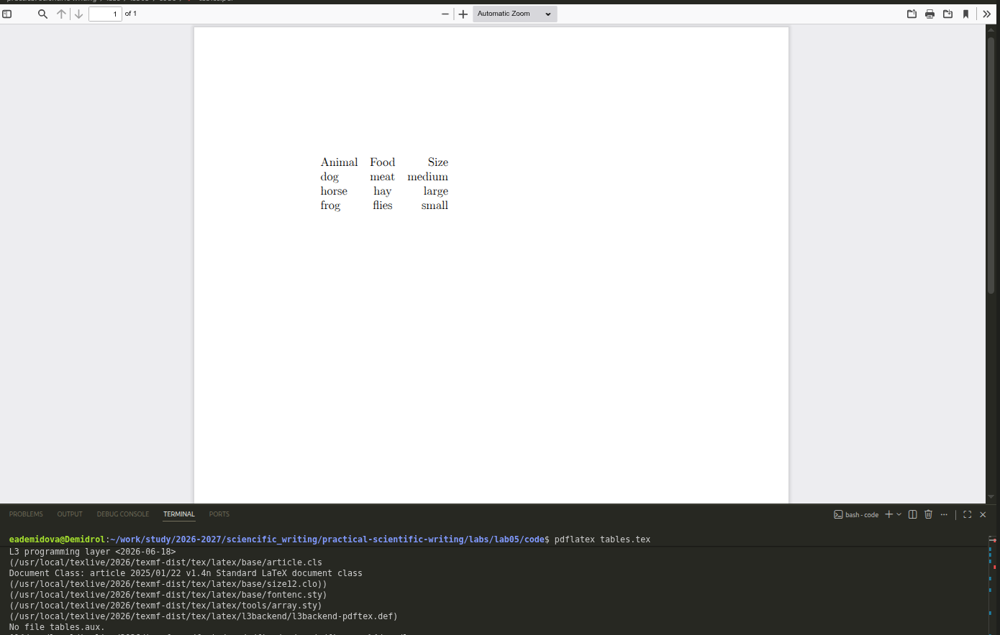
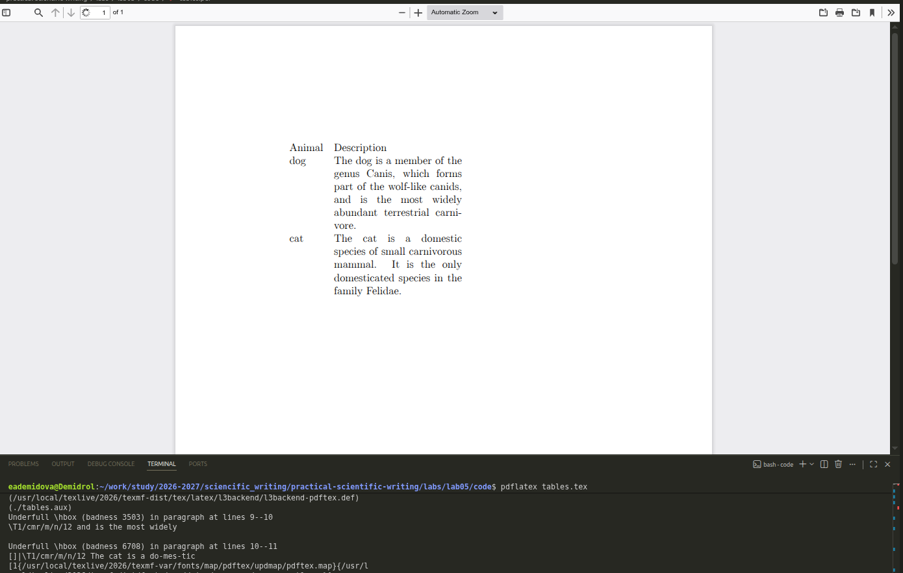
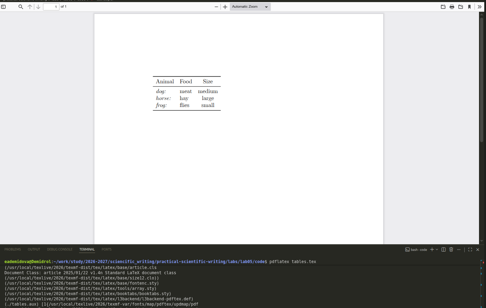
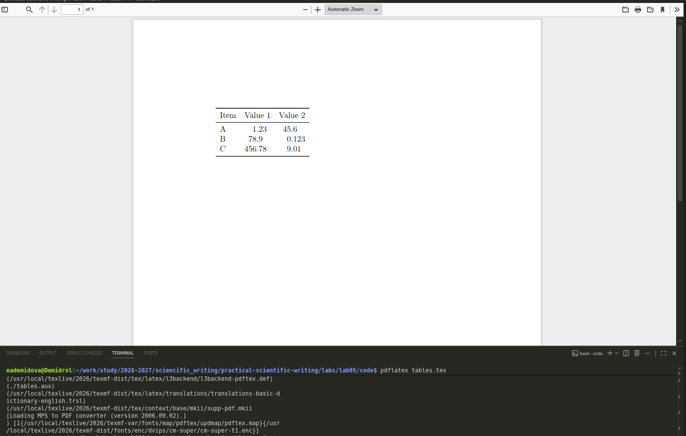

---
## Author
author:
  name: Демидова Екатерина Алексеевна
  degrees: BSc
  orcid: 0000-0002-0877-6063
  email: 1032259377@rudn.ru
  affiliation:
    - name: Российский университет дружбы народов
      country: Российская Федерация
      postal-code: 117198
      city: Москва
      address: ул. Миклухо-Маклая, д. 6
## Title
title: "Лабораторная работа №5"
subtitle: "Tables"
license: "CC BY"
date: today
date-format: "YYYY-MM-DD" # Example: 2025-09-06
---

# Введение

## Цель работы

В ходе лабораторной работы требовалось освоить создание и форматирование таблиц в LaTeX, включая использование пакетов `array`, `booktabs`, `tabularx`, `longtable`, а также настройку выравнивания, объединение ячеек, работу с числовыми данными и оформление профессиональных таблиц.

## Задание

1. Изучить базовое окружение `tabular` и типы колонок (`l`, `c`, `r`, `p`).
2. Освоить использование пакета `booktabs` для создания профессиональных таблиц с горизонтальными линиями.
3. Изучить объединение ячеек с помощью `\multicolumn`.
4. Освоить стилизацию колонок с использованием `>` и `<`.
5. Изучить управление межколоночными промежутками с помощью `@` и `!`.
6. Освоить числовое выравнивание с пакетом `siunitx`.
7. Изучить управление общей шириной таблицы с помощью `tabular*` и `tabularx`.
8. Познакомиться с многостраничными таблицами (`longtable`) и примечаниями к таблицам (`threeparttable`).

# Ход выполнения работы

## Базовое создание таблиц

{#fig-01 width=60%}

## Проблема длинного текста и использование p-колонки

{#fig-02 width=60%}

## Профессиональные линии с booktabs

{#fig-03 width=60%}

## Частичные линии с `\cmidrule`

{#fig-04 width=60%}

## Добавление отступов между строками

{#fig-05 width=60%}

## Объединение ячеек с `\multicolumn`

{#fig-06 width=60%}

## Стилизация колонок с > и <

{#fig-07 width=60%}

## Управление межколоночными промежутками

{#fig-08 width=60%}

## Числовое выравнивание с siunitx

{#fig-09 width=60%}

## Управление общей шириной: tabularx

{#fig-10 width=60%}

## Многостраничные таблицы (longtable) и примечания (threeparttable)

{#fig-11 width=60%}

## Настройка межстрочного интервала

{#fig-12 width=60%}

# Выводы

В ходе выполнения лабораторной работы были освоены:

- создание таблиц с типами колонок `l`, `c`, `r`, `p`;
- профессиональное оформление с `booktabs`: `\toprule`, `\midrule`, `\bottomrule`, `\cmidrule`, `\addlinespace`;
- объединение ячеек с `\multicolumn`;
- стилизация колонок с `>` и `<`;
- управление межколоночными промежутками с `@`;
- числовое выравнивание с `siunitx` (тип `S`);
- управление шириной с `tabularx` (тип `X`);
- многостраничные таблицы с `longtable`;
- примечания с `threeparttable`;
- настройка интервала с `\arraystretch` и `\extrarowheight`.

# Список литературы

1. American Mathematical Society. Why Do We Recommend LaTeX? — URL: https://www.ams.org/publications/authors/tex/latexbenefits ; Рекомендации AMS по использованию LaTeX2e. AMS Publications.
2. Lamport L. LaTeX: A Document Preparation System. — 1986. — Первое руководство по LaTeX.
3. LaTeX Project. An introduction to LaTeX. — URL: https://www.latex-project.org/about/ ; Дата обращения: 05.07.2026. Официальный сайт LaTeX.
4. Wikipedia. LaTeX. — URL: https://en.wikipedia.org/wiki/LaTeX ; Общая информация о системе LaTeX. Wikipedia, The Free Encyclopedia.