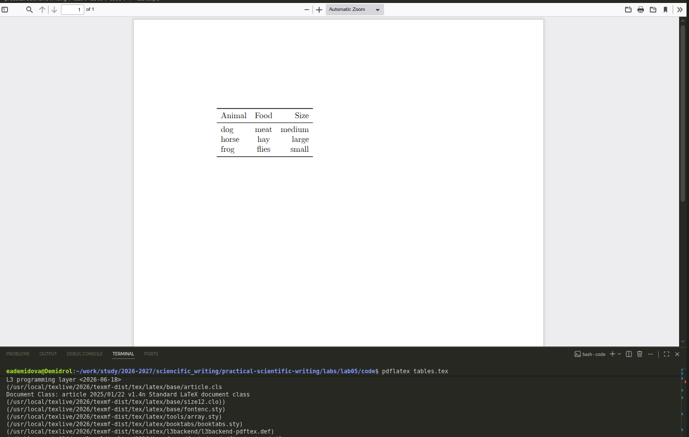
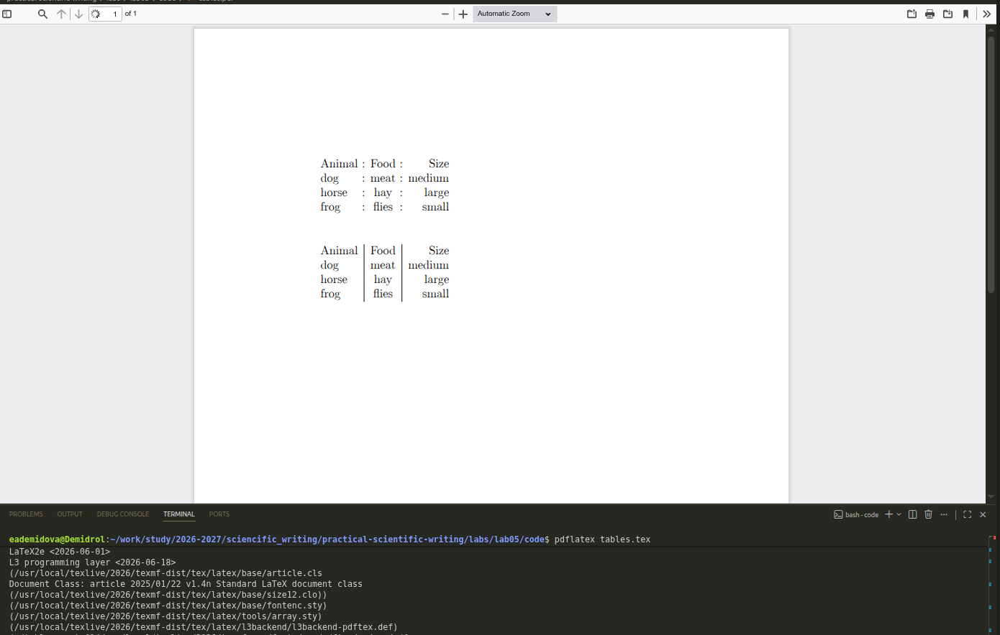
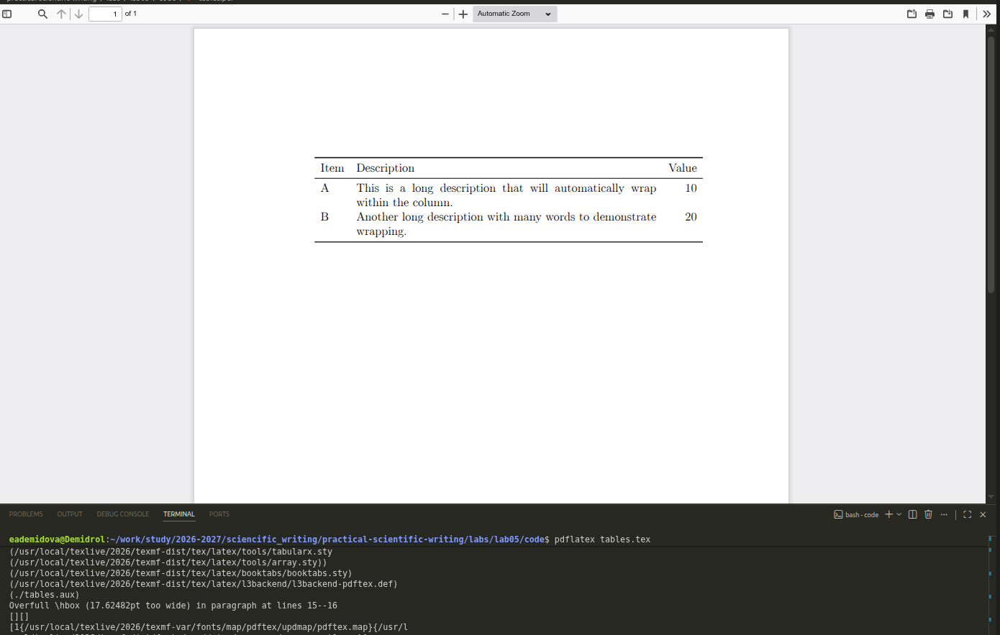
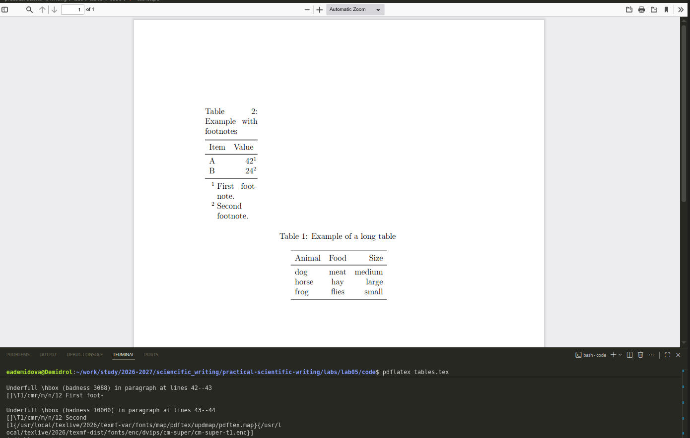
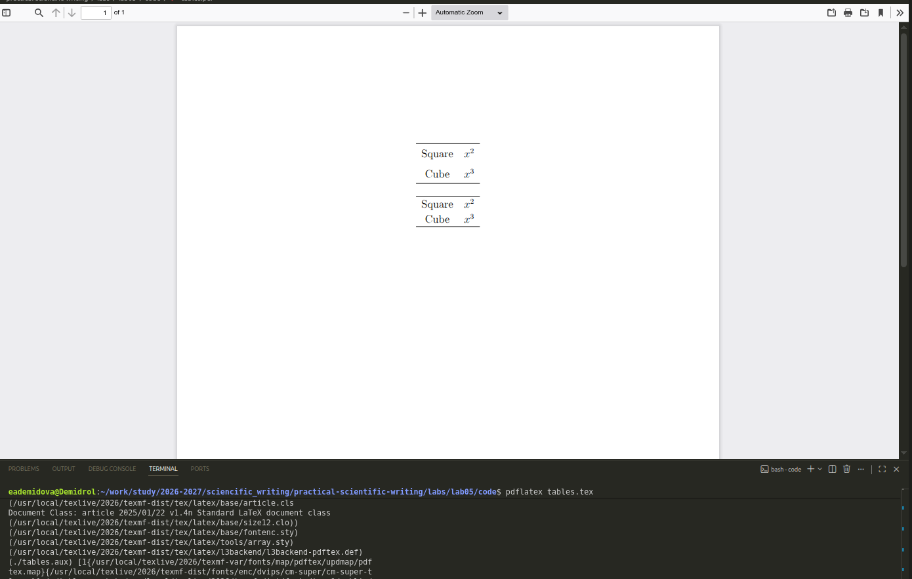

---
## Author
author:
  name: Демидова Екатерина Алексеевна
  degrees: BSc
  orcid: 0000-0002-0877-7063
  email: 1032259377@rudn.ru
  affiliation:
    - name: Российский университет дружбы народов
      country: Российская Федерация
      postal-code: 117198
      city: Москва
      address: ул. Миклухо-Маклая, д. 6

## Title
title: "Лабораторная работа №5"
subtitle: "Tables"
license: "CC BY"
---

# Цель работы

В ходе лабораторной работы требовалось освоить создание и форматирование таблиц в LaTeX, включая использование пакетов `array`, `booktabs`, `tabularx`, `longtable`, а также настройку выравнивания, объединение ячеек, работу с числовыми данными и оформление профессиональных таблиц.

# Задание

1. Изучить базовое окружение `tabular` и типы колонок (`l`, `c`, `r`, `p`).
2. Освоить использование пакета `booktabs` для создания профессиональных таблиц с горизонтальными линиями.
3. Изучить объединение ячеек с помощью `\multicolumn`.
4. Освоить стилизацию колонок с использованием `>` и `<`.
5. Изучить управление межколоночными промежутками с помощью `@` и `!`.
6. Освоить числовое выравнивание с пакетом `siunitx`.
7. Изучить управление общей шириной таблицы с помощью `tabular*` и `tabularx`.
8. Познакомиться с многостраничными таблицами (`longtable`) и примечаниями к таблицам (`threeparttable`).

# Теоретическое введение

**LaTeX** — это система подготовки документов высокого типографского качества, построенная на основе языка разметки TeX. В отличие от текстовых процессоров (WYSIWYG), LaTeX использует описательную разметку: автор пишет текстовый файл с командами, определяющими структуру документа, а затем запускает компиляцию для получения готового PDF или DVI. Такой подход обеспечивает разделение содержания и оформления, позволяя сосредоточиться на логике документа, а не на его внешнем виде [@latex_project_intro].

LaTeX был разработан в начале 1980‑х годов **Лесли Лампортом** (Leslie Lamport) в SRI International. Лампорт создал набор макросов для TeX, который затем вырос в полноценную систему. В 1986 году вышло первое руководство пользователя, быстро ставшее популярным. С 1989 года развитие LaTeX перешло к команде под руководством Франка Миттельбаха, а в 1994 году была выпущена стабильная версия **LaTeX2e**, которая используется и сегодня [@lamport_latex_1986; @wikipedia_latex].

Главный принцип LaTeX — **логическая разметка**: автор использует команды типа `\chapter`, `\section`, `\table`, `\figure`, а система сама определяет, как эти элементы должны выглядеть в финальном документе. Это избавляет автора от ручного форматирования и делает документ единообразным. Кроме того, LaTeX обеспечивает автоматическую генерацию оглавлений, списков иллюстраций, перекрёстных ссылок и библиографий, что особенно важно для больших научных работ [@ams_latex_benefits].

Среди основных достоинств LaTeX выделяют:

- **стабильность и предсказуемость** вёрстки;
- **высокое качество** математических формул и типографики;
- **поддержка** крупных проектов с множеством файлов;
- **лёгкость** обмена и совместной работы (исходные файлы — обычный текст);
- **обширная экосистема** пакетов, расширяющих функциональность [@latex_project_intro; @ams_latex_benefits].

Американское математическое общество (AMS) рекомендует LaTeX для подготовки математических публикаций именно благодаря этим качествам [@ams_latex_benefits].

LaTeX широко используется в академической среде — для статей, диссертаций, книг, презентаций, а также в технической документации. Благодаря модульности он остаётся актуальным и сегодня, постоянно обновляясь (последние версии выходят ежегодно). Подробнее об истории и возможностях системы можно прочитать в открытых источниках [@wikipedia_latex].

# Ход выполнения работы

## Базовое создание таблиц

Создадим простую таблицу с тремя колонками ([рис. @fig-01]):

```tex
\documentclass[a4paper,12pt]{article}
\usepackage[T1]{fontenc}
\usepackage{array}

\begin{document}

\begin{tabular}{lcr}
Animal & Food & Size \\
dog & meat & medium \\
horse & hay & large \\
frog & flies & small
\end{tabular}

\end{document}
```

{#fig-01 width=70%}

Здесь использованы колонки с выравниванием по левому краю (l), центрированием (c) и по правому краю (r). Амперсанд `&` разделяет ячейки, а `\\` завершает строку.

## Проблема длинного текста и использование p-колонки

Если в колонке содержится длинный текст, колонки `l`, `c` и `r` не переносят строки. Для решения этой проблемы используется тип `p` с указанием ширины ([рис. @fig-02]):

```tex
\documentclass[a4paper,12pt]{article}
\usepackage[T1]{fontenc}
\usepackage{array}

\begin{document}

\begin{tabular}{lp{5cm}}
Animal & Description \\
dog & The dog is a member of the genus Canis, which forms part of the wolf-like canids, and is the most widely abundant terrestrial carnivore. \\
cat & The cat is a domestic species of small carnivorous mammal. It is the only domesticated species in the family Felidae.
\end{tabular}

\end{document}
```

{#fig-02 width=70%}

## Профессиональные линии с booktabs

Пакет booktabs предоставляет команды для создания аккуратных таблиц с правильно подобранными линиями ([рис. @fig-03]):

```tex
\documentclass[a4paper,12pt]{article}
\usepackage[T1]{fontenc}
\usepackage{array}
\usepackage{booktabs}

\begin{document}

\begin{tabular}{lcr}
\toprule
Animal & Food & Size \\
\midrule
dog & meat & medium \\
horse & hay & large \\
frog & flies & small \\
\bottomrule
\end{tabular}

\end{document}
```

{#fig-03 width=70%}

Команды `\toprule`, `\midrule` и `\bottomrule` имеют различную толщину и отступы, что придаёт таблице профессиональный вид. Вертикальные линии в профессиональных таблицах обычно не используются.

## Частичные линии с `\cmidrule`

Команда `\cmidrule` позволяет провести линию только через определённые колонки ([рис. @fig-04]):

```tex
\documentclass[a4paper,12pt]{article}
\usepackage[T1]{fontenc}
\usepackage{array}
\usepackage{booktabs}

\begin{document}

\begin{tabular}{lcr}
\toprule
Animal & Food & Size \\
\midrule
dog & meat & medium \\
horse & hay & large \\
\cmidrule{1-2}
frog & flies & small \\
\bottomrule
\end{tabular}

\end{document}
```

{#fig-04 width=70%}

## Добавление отступов между строками

Команда `\addlinespace` добавляет небольшой вертикальный отступ между строками ([рис. @fig-05]):

```tex
\documentclass[a4paper,12pt]{article}
\usepackage[T1]{fontenc}
\usepackage{array}
\usepackage{booktabs}

\begin{document}

\begin{tabular}{lp{8cm}}
\toprule
Animal & Description \\
\midrule
dog & The dog is a member of the genus Canis. \\
\addlinespace
cat & The cat is a domestic species of small carnivorous mammal. \\
\addlinespace
frog & Frogs are a diverse group of short-bodied, tailless amphibians. \\
\bottomrule
\end{tabular}

\end{document}
```

{#fig-05 width=70%}

## Объединение ячеек с `\multicolumn`

Команда `\multicolumn` объединяет несколько ячеек по горизонтали ([рис. @fig-06]):

```tex
\documentclass[a4paper,12pt]{article}
\usepackage[T1]{fontenc}
\usepackage{array}
\usepackage{booktabs}

\begin{document}

\begin{tabular}{lcr}
\toprule
Animal & Food & Size \\
\midrule
dog & meat & medium \\
horse & hay & large \\
frog & flies & small \\
\cmidrule{1-3}
\multicolumn{3}{c}{All animals need food to survive} \\
\bottomrule
\end{tabular}

\end{document}
```

{#fig-06 width=70%}

## Стилизация колонок с > и <

Используя `>` и `<`, можно применять команды к содержимому колонок ([рис. @fig-07]):

```tex
\documentclass[a4paper,12pt]{article}
\usepackage[T1]{fontenc}
\usepackage{array}
\usepackage{booktabs}

\begin{document}

\begin{tabular}{>{\itshape}l<{:} lcr}
\toprule
\multicolumn{1}{l}{Animal} & Food & Size \\
\midrule
dog & meat & medium \\
horse & hay & large \\
frog & flies & small \\
\bottomrule
\end{tabular}

\end{document}
```

{#fig-07 width=70%}

Первая колонка отображается курсивом, и после каждой ячейки добавляется двоеточие. Для заголовка использован `\multicolumn`, чтобы отключить стилизацию.

## Управление межколоночными промежутками

Команда `@` заменяет стандартный промежуток между колонками, а `!` вставляет элемент в центр существующего промежутка ([рис. @fig-08]):

```tex
\documentclass[a4paper,12pt]{article}
\usepackage[T1]{fontenc}
\usepackage{array}

\begin{document}

% Замена промежутка на двоеточие
\begin{tabular}{l @{ : } c @{ : } r}
Animal & Food & Size \\
dog & meat & medium \\
horse & hay & large \\
frog & flies & small
\end{tabular}

\vspace{1cm}

% Добавление вертикальной черты в центр промежутка
\begin{tabular}{l !{\vrule} c !{\vrule} r}
Animal & Food & Size \\
dog & meat & medium \\
horse & hay & large \\
frog & flies & small
\end{tabular}

\end{document}
```

{#fig-08 width=70%}

## Числовое выравнивание с siunitx

Пакет siunitx предоставляет тип колонки `S` для выравнивания чисел по десятичному разделителю ([рис. @fig-09]):

```tex
\documentclass[a4paper,12pt]{article}
\usepackage[T1]{fontenc}
\usepackage{booktabs}
\usepackage{siunitx}

\begin{document}

\begin{tabular}{lSS}
\toprule
Item & {Value 1} & {Value 2} \\
\midrule
A & 1.23 & 45.6 \\
B & 78.9 & 0.123 \\
C & 456.78 & 9.01 \\
\bottomrule
\end{tabular}

\end{document}
```

{#fig-09 width=70%}

Нечисловые ячейки (заголовки) должны быть заключены в фигурные скобки для защиты от обработки пакетом siunitx.

## Управление общей шириной: tabularx

Окружение tabularx (тип колонки `X`) автоматически подбирает ширину для заполнения заданного пространства ([рис. @fig-10]):

```tex
\documentclass[a4paper,12pt]{article}
\usepackage[T1]{fontenc}
\usepackage{tabularx}
\usepackage{booktabs}

\begin{document}

\begin{tabularx}{\textwidth}{lXr}
\toprule
Item & Description & Value \\
\midrule
A & This is a long description that will automatically wrap within the column. & 10 \\
B & Another long description with many words to demonstrate wrapping. & 20 \\
\bottomrule
\end{tabularx}

\end{document}
```

{#fig-10 width=70%}

## Многостраничные таблицы (longtable) и примечания (threeparttable)

Пакет longtable разбивает таблицу на несколько страниц, threeparttable добавляет примечания ([рис. @fig-11]):

```tex
\documentclass[a4paper,12pt]{article}
\usepackage[T1]{fontenc}
\usepackage{longtable}
\usepackage{threeparttable}
\usepackage{booktabs}

\begin{document}

% Многостраничная таблица
\begin{longtable}{lcr}
\caption{Пример длинной таблицы} \\
\toprule
Animal & Food & Size \\
\midrule
\endhead
\bottomrule
\multicolumn{3}{r}{Продолжение на следующей странице} \\
\endfoot
\bottomrule
\endlastfoot
dog & meat & medium \\
horse & hay & large \\
frog & flies & small \\
% ... множество строк для демонстрации переноса ...
\end{longtable}

\vspace{1cm}

% Таблица с примечаниями
\begin{table}
\begin{threeparttable}
\caption{Пример с примечаниями}
\begin{tabular}{lr}
\toprule
Item & Value \\
\midrule
A & 42\tnote{1} \\
B & 24\tnote{2} \\
\bottomrule
\end{tabular}
\begin{tablenotes}
\item [1] Первое примечание.
\item [2] Второе примечание.
\end{tablenotes}
\end{threeparttable}
\end{table}

\end{document}
```

{#fig-11 width=70%}

## Настройка межстрочного интервала

Параметры `\arraystretch` и `\extrarowheight` управляют интервалом в таблицах ([рис. @fig-12]):

```tex
\documentclass[a4paper,12pt]{article}
\usepackage[T1]{fontenc}
\usepackage{array}

\begin{document}

% Увеличение интервала на 50%
\begin{center}
\renewcommand{\arraystretch}{1.5}
\begin{tabular}{cc}
\hline
Square & $x^2$ \\
Cube & $x^3$ \\
\hline
\end{tabular}
\end{center}

% Увеличение высоты строк на 2pt
\begin{center}
\setlength{\extrarowheight}{2pt}
\begin{tabular}{cc}
\hline
Square & $x^2$ \\
Cube & $x^3$ \\
\hline
\end{tabular}
\end{center}

\end{document}
```

{#fig-12 width=70%}

# Выводы

В ходе выполнения лабораторной работы были освоены:

- создание таблиц с типами колонок `l`, `c`, `r`, `p`;
- профессиональное оформление с `booktabs`: `\toprule`, `\midrule`, `\bottomrule`, `\cmidrule`, `\addlinespace`;
- объединение ячеек с `\multicolumn`;
- стилизация колонок с `>` и `<`;
- управление межколоночными промежутками с `@`;
- числовое выравнивание с `siunitx` (тип `S`);
- управление шириной с `tabularx` (тип `X`);
- многостраничные таблицы с `longtable`;
- примечания с `threeparttable`;
- настройка интервала с `\arraystretch` и `\extrarowheight`.# Список литературы{.unnumbered}

# Список литературы{.unnumbered}

::: {#refs}
:::