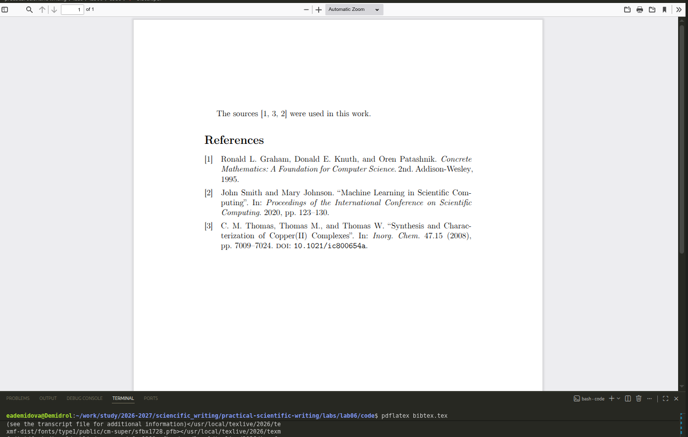

---
## Author
author:
  name: Демидова Екатерина Алексеевна
  degrees: BSc
  orcid: 0000-0002-0877-6063
  email: 1032259377@rudn.ru
  affiliation:
    - name: Российский университет дружбы народов
      country: Российская Федерация
      postal-code: 117198
      city: Москва
      address: ул. Миклухо-Маклая, д. 6
## Title
title: "Лабораторная работа №6"
subtitle: "Working with bibliography"
license: "CC BY"
date: today
date-format: "YYYY-MM-DD" # Example: 2025-09-06
---

# Цель работы

В ходе лабораторной работы требовалось освоить создание и управление библиографией в LaTeX, включая работу с BibTeX-файлами, использование пакетов `natbib` и `biblatex`, выбор стилей оформления, а также настройку гиперссылок и работу с нелатинскими символами.

# Задание

1. Изучить структуру BibTeX-файла и создание записей различных типов (статьи, книги).
2. Освоить два основных подхода к управлению библиографией: BibTeX + natbib и biblatex + Biber.
3. Изучить различные стили цитирования (автор-год, числовой).
4. Освоить создание ссылок с дополнительными комментариями и номерами страниц.
5. Изучить работу с гиперссылками в библиографии.
6. Познакомиться с особенностями сортировки нелатинских символов.

# Ход выполнения работы

## Работа с natbib (BibTeX)

{#fig-01 width=60%}

## Числовой стиль в natbib

{#fig-02 width=60%}

## Работа с biblatex

{#fig-03 width=60%}

### Сравнение команд natbib и biblatex

{#fig-04 width=60%}

## Гиперссылки в библиографии

{#fig-05 width=60%}

## Сравнение подходов BibTeX и biblatex

{#fig-06 width=60%}

# Выводы

В ходе выполнения лабораторной работы были освоены:

- создание BibTeX-файлов с записями различных типов (@article, @book, @inproceedings, @misc);
- использование пакета `natbib` с классическим BibTeX: команды `\citet`, `\citep`, выбор стиля `plainnat`, добавление номеров страниц и примечаний;
- использование пакета `biblatex` с Biber: команды `\textcite`, `\parentcite`, `\autocite`, настройка стиля `authoryear` или `numeric` при загрузке пакета;
- сравнение двух подходов: классический BibTeX лучше подходит для публикаций в журналах, biblatex предоставляет больше возможностей для настройки и лучше работает с нелатинскими символами;
- создание гиперссылок в библиографии с помощью пакета `hyperref`;
- работа с библиографией на русском языке с использованием biblatex и Biber для корректной сортировки нелатинских символов.

# Список литературы

1. American Mathematical Society. Why Do We Recommend LaTeX? — URL: https://www.ams.org/publications/authors/tex/latexbenefits ; Рекомендации AMS по использованию LaTeX2e. AMS Publications.
2. Lamport L. LaTeX: A Document Preparation System. — 1986. — Первое руководство по LaTeX.
3. LaTeX Project. An introduction to LaTeX. — URL: https://www.latex-project.org/about/ ; Дата обращения: 05.07.2026. Официальный сайт LaTeX.
4. Wikipedia. LaTeX. — URL: https://en.wikipedia.org/wiki/LaTeX ; Общая информация о системе LaTeX. Wikipedia, The Free Encyclopedia.