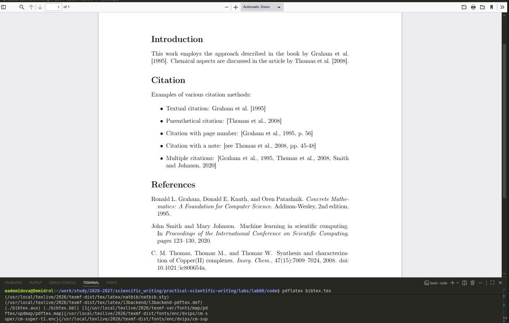
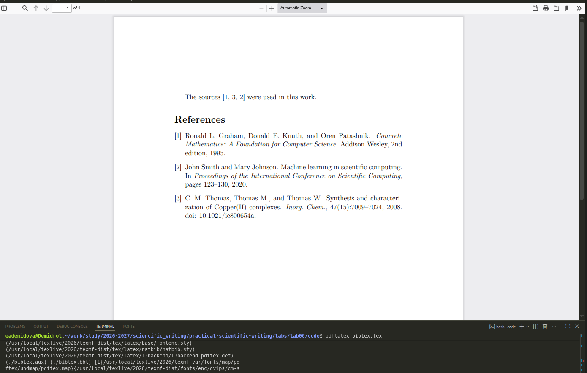
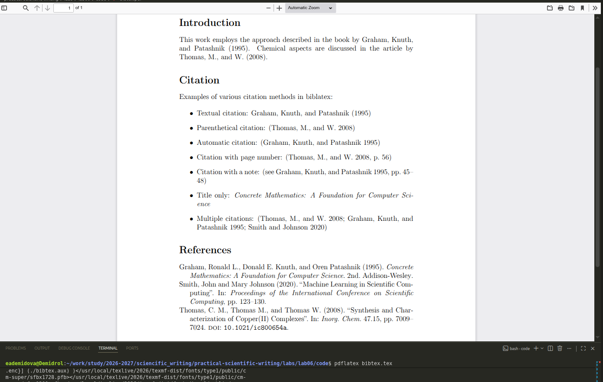
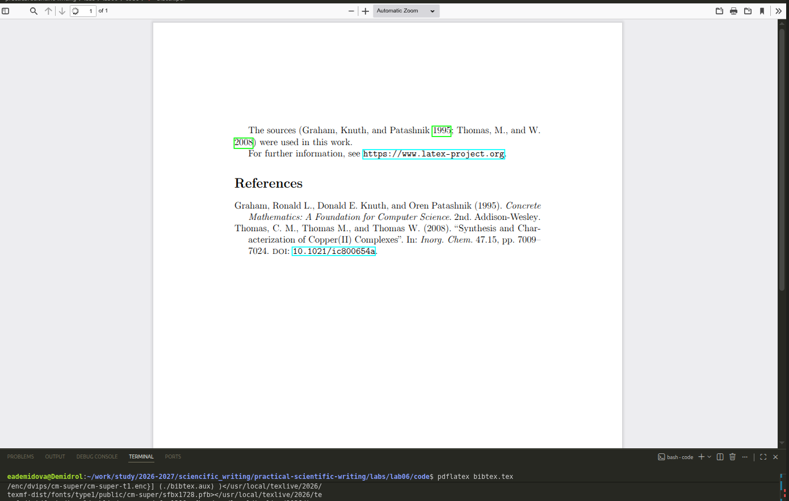
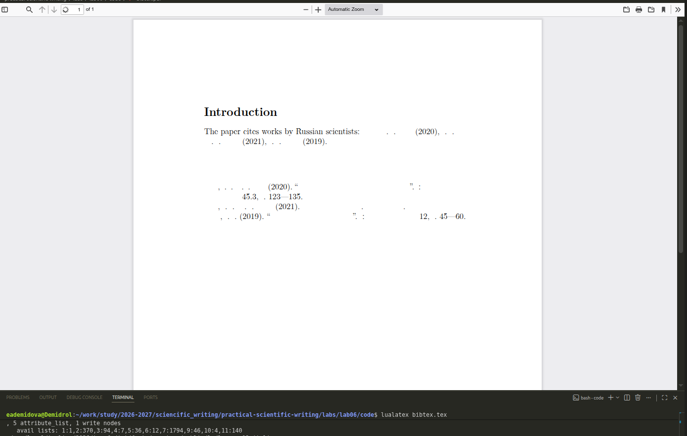

---
## Author
author:
  name: Демидова Екатерина Алексеевна
  degrees: BSc
  orcid: 0000-0002-0877-7063
  email: 1032259377@rudn.ru
  affiliation:
    - name: Российский университет дружбы народов
      country: Российская Федерация
      postal-code: 117198
      city: Москва
      address: ул. Миклухо-Маклая, д. 6

## Title
title: "Лабораторная работа №6"
subtitle: "Working with bibliography"
license: "CC BY"
---

# Цель работы

В ходе лабораторной работы требовалось освоить создание и управление библиографией в LaTeX, включая работу с BibTeX-файлами, использование пакетов `natbib` и `biblatex`, выбор стилей оформления, а также настройку гиперссылок и работу с нелатинскими символами.

# Задание

1. Изучить структуру BibTeX-файла и создание записей различных типов (статьи, книги).
2. Освоить два основных подхода к управлению библиографией: BibTeX + natbib и biblatex + Biber.
3. Изучить различные стили цитирования (автор-год, числовой).
4. Освоить создание ссылок с дополнительными комментариями и номерами страниц.
5. Изучить работу с гиперссылками в библиографии.
6. Познакомиться с особенностями сортировки нелатинских символов.

# Теоретическое введение

**LaTeX** — это система подготовки документов высокого типографского качества, построенная на основе языка разметки TeX. В отличие от текстовых процессоров (WYSIWYG), LaTeX использует описательную разметку: автор пишет текстовый файл с командами, определяющими структуру документа, а затем запускает компиляцию для получения готового PDF или DVI. Такой подход обеспечивает разделение содержания и оформления, позволяя сосредоточиться на логике документа, а не на его внешнем виде [@latex_project_intro].

LaTeX был разработан в начале 1980‑х годов **Лесли Лампортом** (Leslie Lamport) в SRI International. Лампорт создал набор макросов для TeX, который затем вырос в полноценную систему. В 1986 году вышло первое руководство пользователя, быстро ставшее популярным. С 1989 года развитие LaTeX перешло к команде под руководством Франка Миттельбаха, а в 1994 году была выпущена стабильная версия **LaTeX2e**, которая используется и сегодня [@lamport_latex_1986; @wikipedia_latex].

Главный принцип LaTeX — **логическая разметка**: автор использует команды типа `\chapter`, `\section`, `\table`, `\figure`, а система сама определяет, как эти элементы должны выглядеть в финальном документе. Это избавляет автора от ручного форматирования и делает документ единообразным. Кроме того, LaTeX обеспечивает автоматическую генерацию оглавлений, списков иллюстраций, перекрёстных ссылок и библиографий, что особенно важно для больших научных работ [@ams_latex_benefits].

Среди основных достоинств LaTeX выделяют:

- **стабильность и предсказуемость** вёрстки;
- **высокое качество** математических формул и типографики;
- **поддержка** крупных проектов с множеством файлов;
- **лёгкость** обмена и совместной работы (исходные файлы — обычный текст);
- **обширная экосистема** пакетов, расширяющих функциональность [@latex_project_intro; @ams_latex_benefits].

Американское математическое общество (AMS) рекомендует LaTeX для подготовки математических публикаций именно благодаря этим качествам [@ams_latex_benefits].

LaTeX широко используется в академической среде — для статей, диссертаций, книг, презентаций, а также в технической документации. Благодаря модульности он остаётся актуальным и сегодня, постоянно обновляясь (последние версии выходят ежегодно). Подробнее об истории и возможностях системы можно прочитать в открытых источниках [@wikipedia_latex].

# Ход выполнения работы

## Создание BibTeX-файла

Создадим файл `references.bib` с примерами библиографических записей:

```bib
@article{Thomas2008,
  author = {Thomas, C. M. and M., Thomas and W., Thomas},
  title = {Synthesis and Characterization of {Copper(II)} Complexes},
  journal = {Inorg. Chem.},
  year = {2008},
  volume = {47},
  number = {15},
  pages = {7009-7024},
  doi = {10.1021/ic800654a},
}

@book{Graham1995,
  author = {Graham, Ronald L. and Knuth, Donald E. and Patashnik, Oren},
  title = {Concrete Mathematics: A Foundation for Computer Science},
  publisher = {Addison-Wesley},
  year = {1995},
  edition = {2nd},
}

@inproceedings{Smith2020,
  author = {Smith, John and Johnson, Mary},
  title = {Machine Learning in Scientific Computing},
  booktitle = {Proceedings of the International Conference on Scientific Computing},
  year = {2020},
  pages = {123-130},
}

@misc{LaTeXProject,
  author = {LaTeX Project Team},
  title = {LaTeX -- A Document Preparation System},
  year = {2024},
  url = {https://www.latex-project.org},
}
```

## Работа с natbib (BibTeX)

Создадим документ, использующий пакет `natbib` для управления библиографией ([рис. @fig-01]):

```tex
\documentclass[a4paper,12pt]{article}
\usepackage[T1]{fontenc}
\usepackage{natbib}

\begin{document}

\section*{Введение}

В работе используется подход, описанный в книге \citet{Graham1995}. 
Химические аспекты рассмотрены в статье \citet{Thomas2008}.

\section*{Цитирование}

Примеры различных способов цитирования:

\begin{itemize}
\item Текстовое цитирование: \citet{Graham1995}
\item Цитирование в скобках: \citep{Thomas2008}
\item Цитирование с номером страницы: \citep[p.~56]{Graham1995}
\item Цитирование с примечанием: \citep[см.][pp.~45-48]{Thomas2008}
\item Совместное цитирование: \citep{Graham1995,Thomas2008,Smith2020}
\end{itemize}

\bibliographystyle{plainnat}
\bibliography{references}

\end{document}
```

{#fig-01 width=70%}

### Детальный разбор команд natbib

| Команда | Назначение | Пример вывода |
|---------|------------|---------------|
| `\citet{key}` | Текстовое цитирование | Graham et al. (1995) |
| `\citep{key}` | Цитирование в скобках | (Graham et al., 1995) |
| `\citet[p.~56]{key}` | С указанием страницы | Graham et al. (1995, p. 56) |
| `\citep[см.][p.~56]{key}` | С примечанием и страницей | (см. Graham et al., 1995, p. 56) |
| `\citep{key1,key2}` | Несколько источников | (Graham et al., 1995; Thomas et al., 2008) |

## Числовой стиль в natbib

Для переключения на числовой стиль добавляем опцию `numbers` ([рис. @fig-02]):

```tex
\documentclass[a4paper,12pt]{article}
\usepackage[T1]{fontenc}
\usepackage[numbers]{natbib}

\begin{document}

В работе использованы источники \citep{Graham1995,Thomas2008,Smith2020}.

\bibliographystyle{plainnat}
\bibliography{references}

\end{document}
```

{#fig-02 width=70%}

## Работа с biblatex

Создадим документ с использованием пакета `biblatex` ([рис. @fig-03]):

```tex
\documentclass[a4paper,12pt]{article}
\usepackage[T1]{fontenc}
\usepackage[style=authoryear, backend=biber]{biblatex}
\addbibresource{references.bib}

\begin{document}

\section*{Введение}

В работе используется подход, описанный в книге \textcite{Graham1995}.
Химические аспекты рассмотрены в статье \textcite{Thomas2008}.

\section*{Цитирование}

Примеры различных способов цитирования в biblatex:

\begin{itemize}
\item Текстовое цитирование: \textcite{Graham1995}
\item Цитирование в скобках: \parencite{Thomas2008}
\item Автоматическое цитирование: \autocite{Graham1995}
\item Цитирование с номером страницы: \autocite[56]{Thomas2008}
\item Цитирование с примечанием: \autocite[см.][45-48]{Graham1995}
\item Только название: \citetitle{Graham1995}
\item Совместное цитирование: \autocite{Thomas2008,Graham1995,Smith2020}
\end{itemize}

\printbibliography

\end{document}
```

{#fig-03 width=70%}

### Сравнение команд natbib и biblatex

| Назначение | natbib | biblatex |
|------------|--------|----------|
| Текстовое цитирование | `\citet{key}` | `\textcite{key}` |
| Цитирование в скобках | `\citep{key}` | `\parentcite{key}` |
| Универсальное цитирование | — | `\autocite{key}` |
| Только название | — | `\citetitle{key}` |
| Только автор | — | `\citeauthor{key}` |
| Только год | — | `\citeyear{key}` |

## Числовой стиль в biblatex

Переключение на числовой стиль ([рис. @fig-04]):

```tex
\documentclass[a4paper,12pt]{article}
\usepackage[T1]{fontenc}
\usepackage[style=numeric, backend=biber]{biblatex}
\addbibresource{references.bib}

\begin{document}

В работе использованы источники \autocite{Graham1995,Thomas2008,Smith2020}.

\printbibliography

\end{document}
```

{#fig-04 width=70%}

## Гиперссылки в библиографии

Подключение пакета `hyperref` создаёт активные ссылки ([рис. @fig-05]):

```tex
\documentclass[a4paper,12pt]{article}
\usepackage[T1]{fontenc}
\usepackage[style=authoryear, backend=biber]{biblatex}
\usepackage{hyperref}
\addbibresource{references.bib}

\begin{document}

В работе использованы источники \autocite{Graham1995,Thomas2008}.

Для получения дополнительной информации см. \url{https://www.latex-project.org}.

\printbibliography

\end{document}
```

{#fig-05 width=70%}

## Сравнение подходов BibTeX и biblatex

| Критерий | BibTeX + natbib | biblatex + Biber |
|----------|-----------------|------------------|
| Поддержка Unicode | Ограниченная (ASCII) | Полная (Unicode) |
| Настройка стиля | Через .bst-файлы | Из преамбулы документа |
| Гибкость кастомизации | Низкая | Высокая |
| Поддержка издательствами | Широкая | Ограниченная |
| Сортировка нелатинских символов | Проблематична | Корректная |
| Время компиляции | Быстрее | Медленнее |
| Сложность освоения | Низкая | Средняя |

## Сортировка нелатинских символов

При работе с библиографией на русском языке рекомендуется использовать biblatex с Biber ([рис. @fig-06]):

```tex
\documentclass[a4paper,12pt]{article}
\usepackage[T1]{fontenc}
\usepackage[utf8]{inputenc}
\usepackage[style=authoryear, backend=biber, sorting=nyt]{biblatex}
\usepackage{hyperref}
\addbibresource{russian_references.bib}

\begin{document}

В работе цитируются работы российских учёных: \textcite{Иванов2020}, 
\textcite{Петров2021}, \textcite{Сидоров2019}.

\printbibliography

\end{document}
```

{#fig-06 width=70%}

Пример BibTeX-записи на русском языке:

```bib
@article{Иванов2020,
  author = {Иванов, А. А. and Петров, Б. Б.},
  title = {Методы оптимизации в математическом моделировании},
  journal = {Журнал вычислительной математики},
  year = {2020},
  volume = {45},
  number = {3},
  pages = {123-135},
}

@book{Сидоров2019,
  author = {Сидоров, В. В.},
  title = {Основы научных вычислений},
  publisher = {Издательство МГУ},
  year = {2019},
}
```

# Выводы

В ходе выполнения лабораторной работы были освоены:

- создание BibTeX-файлов с записями различных типов (@article, @book, @inproceedings, @misc);
- использование пакета `natbib` с классическим BibTeX: команды `\citet`, `\citep`, выбор стиля `plainnat`, добавление номеров страниц и примечаний;
- использование пакета `biblatex` с Biber: команды `\textcite`, `\parentcite`, `\autocite`, настройка стиля `authoryear` или `numeric` при загрузке пакета;
- сравнение двух подходов: классический BibTeX лучше подходит для публикаций в журналах, biblatex предоставляет больше возможностей для настройки и лучше работает с нелатинскими символами;
- создание гиперссылок в библиографии с помощью пакета `hyperref`;
- работа с библиографией на русском языке с использованием biblatex и Biber для корректной сортировки нелатинских символов.

# Список литературы{.unnumbered}

::: {#refs}
:::