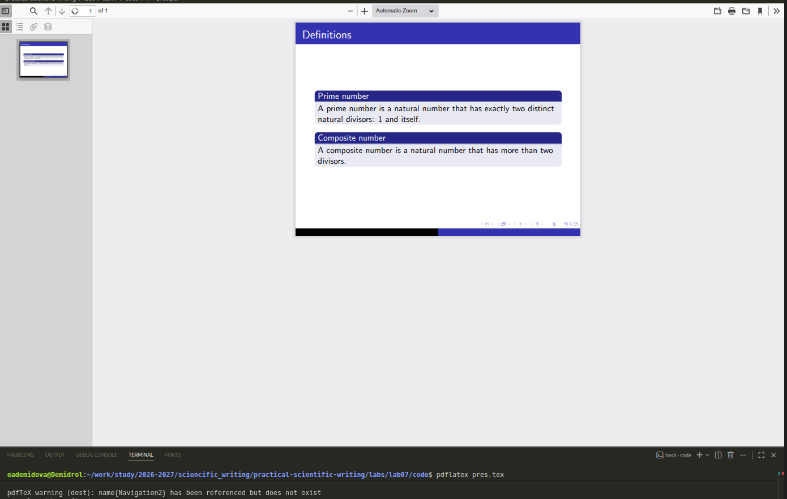
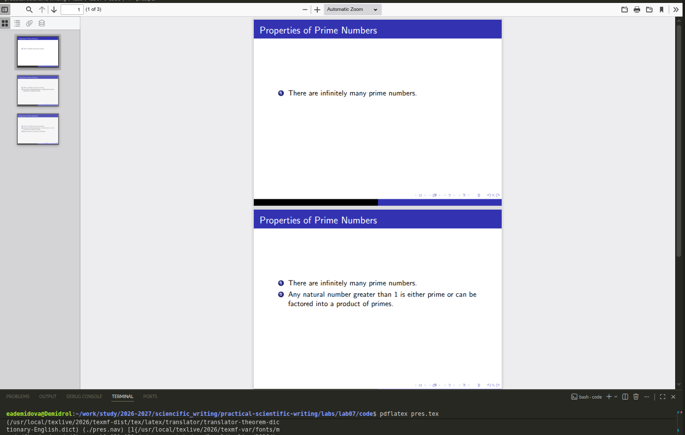
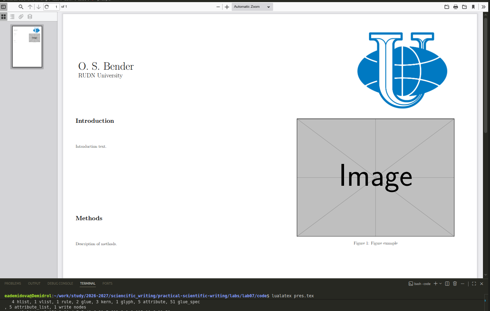

---
## Author
author:
  name: Демидова Екатерина Алексеевна
  degrees: BSc
  orcid: 0000-0002-0877-6063
  email: 1032259377@rudn.ru
  affiliation:
    - name: Российский университет дружбы народов
      country: Российская Федерация
      postal-code: 117198
      city: Москва
      address: ул. Миклухо-Маклая, д. 6
## Title
title: "Лабораторная работа №7"
subtitle: "LaTeX presentations"
license: "CC BY"
date: today
date-format: "YYYY-MM-DD" # Example: 2025-09-06
---

# Цель работы

В ходе лабораторной работы требовалось освоить создание презентаций и постеров в LaTeX с использованием пакета Beamer и специализированных классов для постеров (`a0poster`, `beamerposter`, `tikzposter`).

# Задание

1. Изучить структуру презентации в классе `beamer`.
2. Освоить управление появлением элементов с помощью `\pause` и `\uncover`.
3. Научиться изменять тему оформления презентации.
4. Изучить три основных способа создания постеров: класс `a0poster`, пакет `beamerposter` и класс `tikzposter`.
5. Освоить разделение постера на колонки, вставку изображений, блоков и примечаний.

# Создание презентации в Beamer

## Базовая структура

{#fig-01 width=60%}

## Использование блоков

{#fig-02 width=60%}

## Паузы (`\pause`)

{#fig-03 width=60%}

## Команда `\uncover` для точного управления

{#fig-04 width=60%}

## Смена темы оформления

{#fig-05 width=60%}

# Создание постеров

## Метод 1: Класс a0poster

{#fig-06 width=70%}

## Метод 2: Пакет beamerposter

{#fig-07 width=60%}

## Метод 3: Класс tikzposter

{#fig-08 width=60%}

# Выводы

В ходе выполнения лабораторной работы были освоены:

1. **Создание презентаций в Beamer**: структура документа, использование окружения `frame`, добавление титульного слайда, блоков для структурирования информации.

2. **Управление последовательным появлением**: команды `\pause` (простое разделение) и `\uncover` (гибкое управление появлением на определённых слайдах).

3. **Настройка оформления**: смена тем оформления (`\usetheme`, `\usecolortheme`) для изменения внешнего вида презентации.

4. **Создание постеров тремя способами**:
   - **a0poster**: простой подход, близкий к стандартному документу, с использованием `multicol` для колонок и самодельного заголовка.
   - **beamerposter**: использование тем Beamer, блоков и окружения `columns` для жёсткого разделения на колонки.
   - **tikzposter**: специализированный класс с красивыми блоками, встроенным заголовком и поддержкой примечаний (`\note`).

# Список литературы

1. American Mathematical Society. Why Do We Recommend LaTeX? — URL: https://www.ams.org/publications/authors/tex/latexbenefits ; Рекомендации AMS по использованию LaTeX2e. AMS Publications.
2. Lamport L. LaTeX: A Document Preparation System. — 1986. — Первое руководство по LaTeX.
3. LaTeX Project. An introduction to LaTeX. — URL: https://www.latex-project.org/about/ ; Дата обращения: 05.07.2026. Официальный сайт LaTeX.
4. Wikipedia. LaTeX. — URL: https://en.wikipedia.org/wiki/LaTeX ; Общая информация о системе LaTeX. Wikipedia, The Free Encyclopedia.