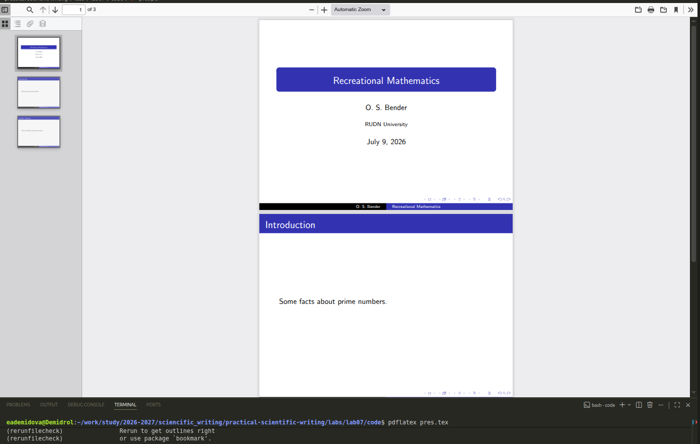
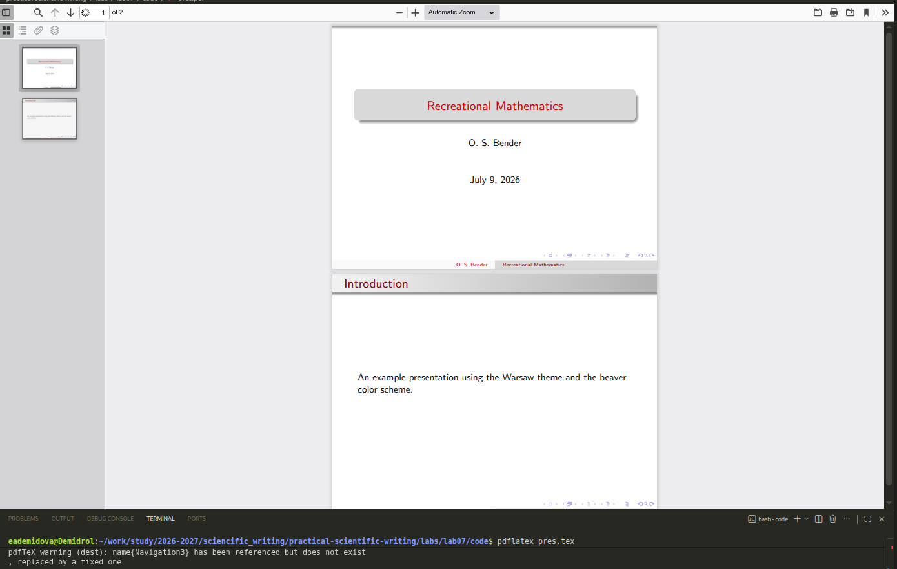
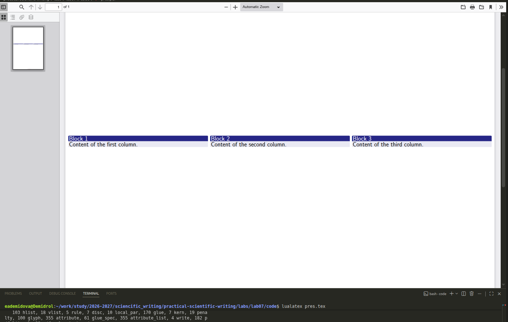
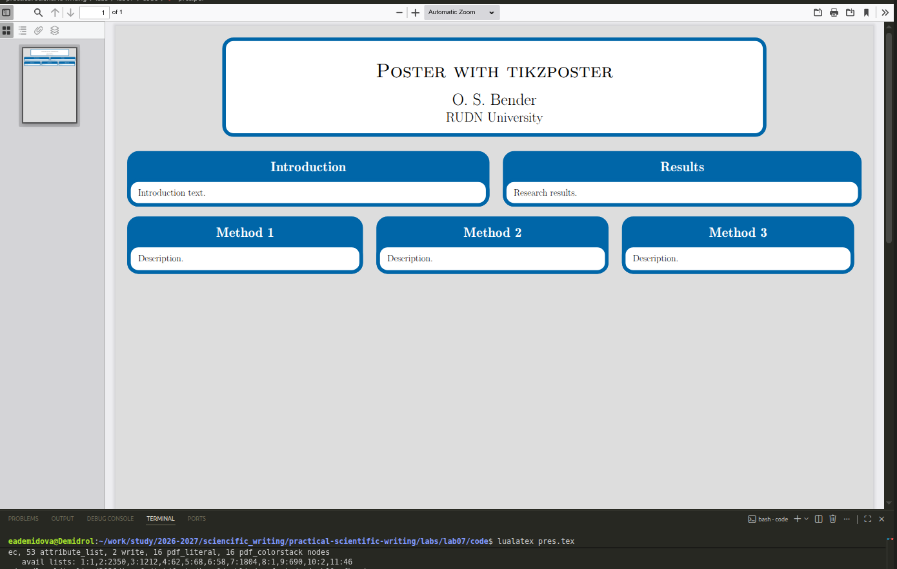

---
## Author
author:
  name: Демидова Екатерина Алексеевна
  degrees: BSc
  orcid: 0000-0002-0877-7063
  email: 1032259377@rudn.ru
  affiliation:
    - name: Российский университет дружбы народов
      country: Российская Федерация
      postal-code: 117198
      city: Москва
      address: ул. Миклухо-Маклая, д. 6

## Title
title: "Лабораторная работа №7"
subtitle: "LaTeX presentations"
license: "CC BY"
---

# Цель работы

В ходе лабораторной работы требовалось освоить создание презентаций и постеров в LaTeX с использованием пакета Beamer и специализированных классов для постеров (`a0poster`, `beamerposter`, `tikzposter`).

# Задание

1. Изучить структуру презентации в классе `beamer`.
2. Освоить управление появлением элементов с помощью `\pause` и `\uncover`.
3. Научиться изменять тему оформления презентации.
4. Изучить три основных способа создания постеров: класс `a0poster`, пакет `beamerposter` и класс `tikzposter`.
5. Освоить разделение постера на колонки, вставку изображений, блоков и примечаний.

# Теоретическое введение

**LaTeX** — это система подготовки документов высокого типографского качества, построенная на основе языка разметки TeX. В отличие от текстовых процессоров (WYSIWYG), LaTeX использует описательную разметку: автор пишет текстовый файл с командами, определяющими структуру документа, а затем запускает компиляцию для получения готового PDF или DVI. Такой подход обеспечивает разделение содержания и оформления, позволяя сосредоточиться на логике документа, а не на его внешнем виде [@latex_project_intro].

LaTeX был разработан в начале 1980‑х годов **Лесли Лампортом** (Leslie Lamport) в SRI International. Лампорт создал набор макросов для TeX, который затем вырос в полноценную систему. В 1986 году вышло первое руководство пользователя, быстро ставшее популярным. С 1989 года развитие LaTeX перешло к команде под руководством Франка Миттельбаха, а в 1994 году была выпущена стабильная версия **LaTeX2e**, которая используется и сегодня [@lamport_latex_1986; @wikipedia_latex].

Главный принцип LaTeX — **логическая разметка**: автор использует команды типа `\chapter`, `\section`, `\table`, `\figure`, а система сама определяет, как эти элементы должны выглядеть в финальном документе. Это избавляет автора от ручного форматирования и делает документ единообразным. Кроме того, LaTeX обеспечивает автоматическую генерацию оглавлений, списков иллюстраций, перекрёстных ссылок и библиографий, что особенно важно для больших научных работ [@ams_latex_benefits].

Среди основных достоинств LaTeX выделяют:

- **стабильность и предсказуемость** вёрстки;
- **высокое качество** математических формул и типографики;
- **поддержка** крупных проектов с множеством файлов;
- **лёгкость** обмена и совместной работы (исходные файлы — обычный текст);
- **обширная экосистема** пакетов, расширяющих функциональность [@latex_project_intro; @ams_latex_benefits].

Американское математическое общество (AMS) рекомендует LaTeX для подготовки математических публикаций именно благодаря этим качествам [@ams_latex_benefits].

LaTeX широко используется в академической среде — для статей, диссертаций, книг, презентаций, а также в технической документации. Благодаря модульности он остаётся актуальным и сегодня, постоянно обновляясь (последние версии выходят ежегодно). Подробнее об истории и возможностях системы можно прочитать в открытых источниках [@wikipedia_latex].

# Ход выполнения работы

## Создание презентации в Beamer

### Базовая структура

Создадим простейшую презентацию с титульным слайдом и несколькими слайдами ([рис. @fig-01]):

```tex
\documentclass{beamer}
\usetheme{Copenhagen}

\author{O. S. Bender}
\title{Recreational Mathematics}
\institute{RUDN University}

\begin{document}

\begin{frame}
\titlepage
\end{frame}

\begin{frame}{Introduction}
Some facts about prime numbers.
\end{frame}

\begin{frame}{Euclid's Theorem}
There are infinitely many prime numbers.
\end{frame}

\end{document}

```

{#fig-01 width=70%}

### Использование блоков

Окружение `block` позволяет структурировать содержимое слайда ([рис. @fig-02]):

```tex
\documentclass{beamer}
\usetheme{Copenhagen}

\begin{document}

\begin{frame}{Определения}
\begin{block}{Простое число}
Простое число — это натуральное число, имеющее ровно два различных натуральных делителя: 1 и само себя.
\end{block}

\begin{block}{Составное число}
Составное число — это натуральное число, имеющее более двух делителей.
\end{block}
\end{frame}

\end{document}
```

{#fig-02 width=70%}

### Паузы (`\pause`)

Команда `\pause` позволяет показывать элементы слайда последовательно ([рис. @fig-03]):

```tex
\documentclass{beamer}
\usetheme{Copenhagen}

\begin{document}

\begin{frame}{Свойства простых чисел}
\begin{enumerate}
\item Простых чисел бесконечно много. \pause
\item Любое натуральное число больше 1 либо простое, либо разлагается в произведение простых. \pause
\item Теорема Евклида доказывается методом от противного.
\end{enumerate}
\end{frame}

\end{document}
```

{#fig-03 width=70%}

### Команда `\uncover` для точного управления

Команда `\uncover` позволяет задать, на каких слайдах (в рамках одного кадра) должен отображаться элемент ([рис. @fig-04]):

```tex
\documentclass{beamer}
\usetheme{Copenhagen}

\begin{document}

\begin{frame}{Интервалы}
Определение: \alert{интервал} — это множество чисел, удовлетворяющих неравенству.
\uncover<2->{
Например: $(a,b) = \{x \in \mathbb{R} : a < x < b\}$.
}
\uncover<3->{
Также: $[a,b] = \{x \in \mathbb{R} : a \leq x \leq b\}$.
}
\end{frame}

\end{document}
```

{#fig-04 width=70%}

### Смена темы оформления

Тему можно изменить, указав другой стиль ([рис. @fig-05]):

```tex
\documentclass{beamer}
\usetheme{Warsaw}
\usecolortheme{beaver}

\author{О. С. Бендер}
\title{Занимательная математика}

\begin{document}

\begin{frame}
\titlepage
\end{frame}

\begin{frame}{Введение}
Пример презентации с темой Warsaw и цветовой схемой beaver.
\end{frame}

\end{document}
```

{#fig-05 width=70%}

## Создание постеров

### Метод 1: Класс a0poster

Создадим постер с использованием класса `a0poster` и пакета `multicol` для разделения на колонки ([рис. @fig-06]):

```tex
\documentclass[a0,portrait]{a0poster}
\usepackage[utf8]{inputenc}
\usepackage[T1]{fontenc}
\usepackage{graphicx}
\usepackage{multicol}
\usepackage{caption}

\columnsep=100pt

\begin{document}

\begin{minipage}{0.7\textwidth}
\Huge О. С. Бендер \\
\Large РУДН
\end{minipage}
\begin{minipage}{0.3\textwidth}
\includegraphics[width=0.8\textwidth]{logo.png}
\end{minipage}

\begin{multicols}{2}

\section*{Введение}
Текст введения.

\section*{Методы}
Описание методов.

\begin{center}
\includegraphics[width=0.4\textwidth]{example-image}
\captionof{figure}{Пример рисунка}
\end{center}

\end{multicols}

\end{document}
```

{#fig-06 width=70%}

### Метод 2: Пакет beamerposter

Используем класс `beamer` с пакетом `beamerposter` и темами Beamer ([рис. @fig-07]):

```tex
\documentclass[svgnames]{beamer}
\usepackage[orientation=portrait,size=a0,scale=1.4]{beamerposter}
\usetheme{Copenhagen}
\usecolortheme{beaver}

\title{Постер с beamerposter}
\author{О. С. Бендер}
\institute{РУДН}

\begin{document}
\begin{frame}
\begin{columns}
\begin{column}{0.33\textwidth}
\block{Блок 1}{Содержимое первой колонки.}
\end{column}
\begin{column}{0.33\textwidth}
\block{Блок 2}{Содержимое второй колонки.}
\end{column}
\begin{column}{0.33\textwidth}
\block{Блок 3}{Содержимое третьей колонки.}
\end{column}
\end{columns}
\end{frame}
\end{document}
```

{#fig-07 width=70%}

### Метод 3: Класс tikzposter

Используем класс `tikzposter` с его темами и блоками ([рис. @fig-08]):

```tex
\documentclass[24pt,a0paper,portrait]{tikzposter}
\usetheme{Default}

\title{Постер с tikzposter}
\author{О. С. Бендер}
\institute{РУДН}

\begin{document}
\maketitle

\begin{columns}
\column{0.5}
\block{Введение}{Текст введения.}

\column{0.5}
\block{Результаты}{Результаты исследования.}
\end{columns}

\begin{columns}
\column{0.33}
\block{Метод 1}{Описание.}
\column{0.33}
\block{Метод 2}{Описание.}
\column{0.33}
\block{Метод 3}{Описание.}
\end{columns}

\end{document}
```

{#fig-08 width=70%}

## Сравнение методов создания постеров

| Критерий | a0poster | beamerposter | tikzposter |
|----------|----------|--------------|------------|
| Сложность освоения | Низкая | Средняя | Средняя |
| Гибкость оформления | Ограниченная | Высокая (темы Beamer) | Высокая (встроенные темы) |
| Поддержка блоков | Нет (используются секции) | Да (block, exampleblock) | Да (`\block`) |
| Разделение на колонки | multicol (потоковый) | columns (жёсткие) | columns (жёсткие) |
| Вставка изображений | center + captionof | стандартные команды | center + captionof |
| Примечания | Нет | Нет | Да (`\note`) |
| Титульный блок | Самодельный (minipage) | Стандартный (titlepage) | Стандартный (\maketitle) |

# Выводы

В ходе выполнения лабораторной работы были освоены:

1. **Создание презентаций в Beamer**: структура документа, использование окружения `frame`, добавление титульного слайда, блоков для структурирования информации.

2. **Управление последовательным появлением**: команды `\pause` (простое разделение) и `\uncover` (гибкое управление появлением на определённых слайдах).

3. **Настройка оформления**: смена тем оформления (`\usetheme`, `\usecolortheme`) для изменения внешнего вида презентации.

4. **Создание постеров тремя способами**:
   - **a0poster**: простой подход, близкий к стандартному документу, с использованием `multicol` для колонок и самодельного заголовка.
   - **beamerposter**: использование тем Beamer, блоков и окружения `columns` для жёсткого разделения на колонки.
   - **tikzposter**: специализированный класс с красивыми блоками, встроенным заголовком и поддержкой примечаний (`\note`).

5. **Сравнение методов**: каждый подход имеет свои преимущества; выбор зависит от требуемого дизайна и уровня подготовки пользователя.

# Список литературы{.unnumbered}

::: {#refs}
:::