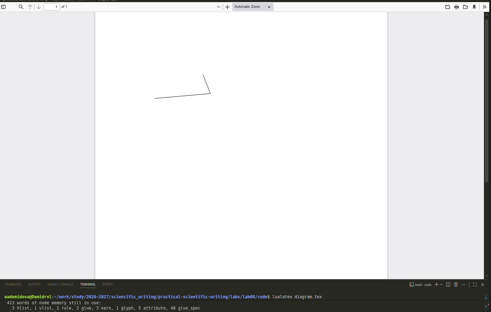
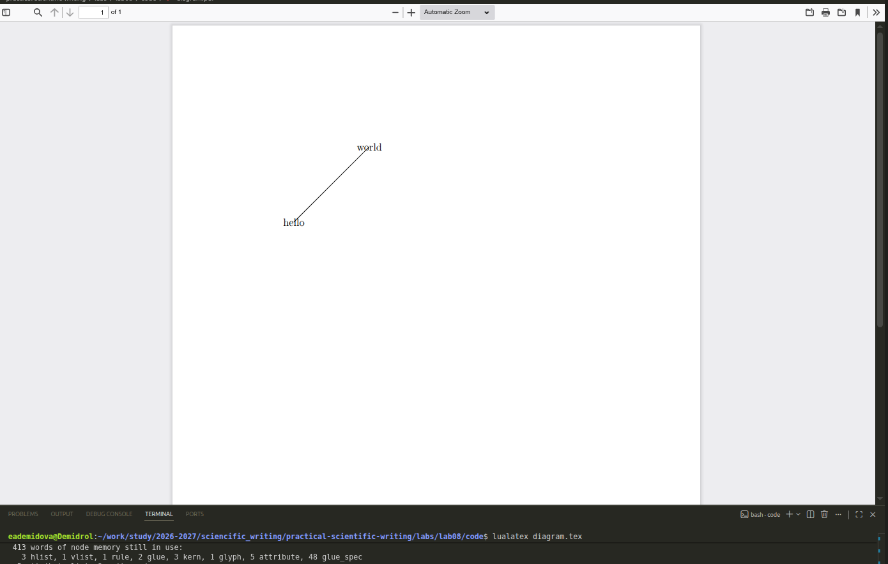
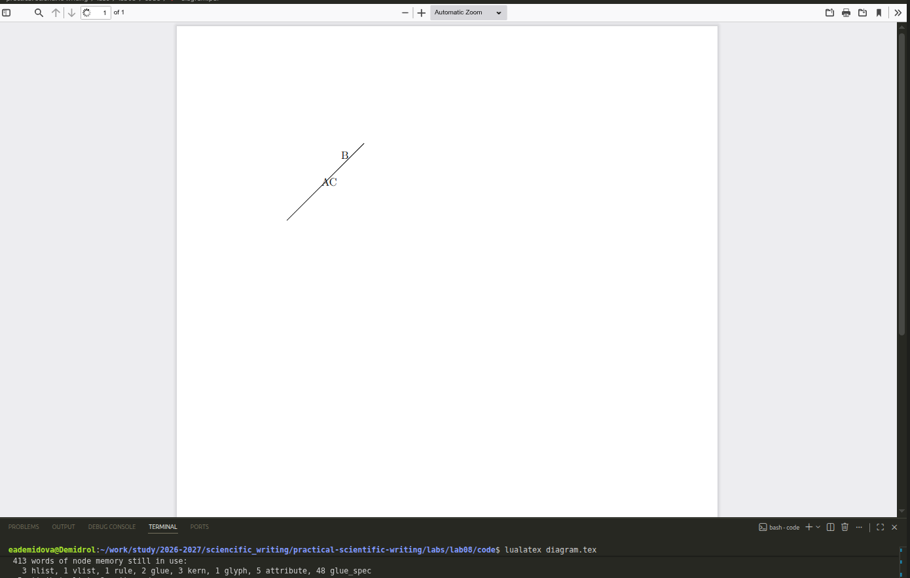
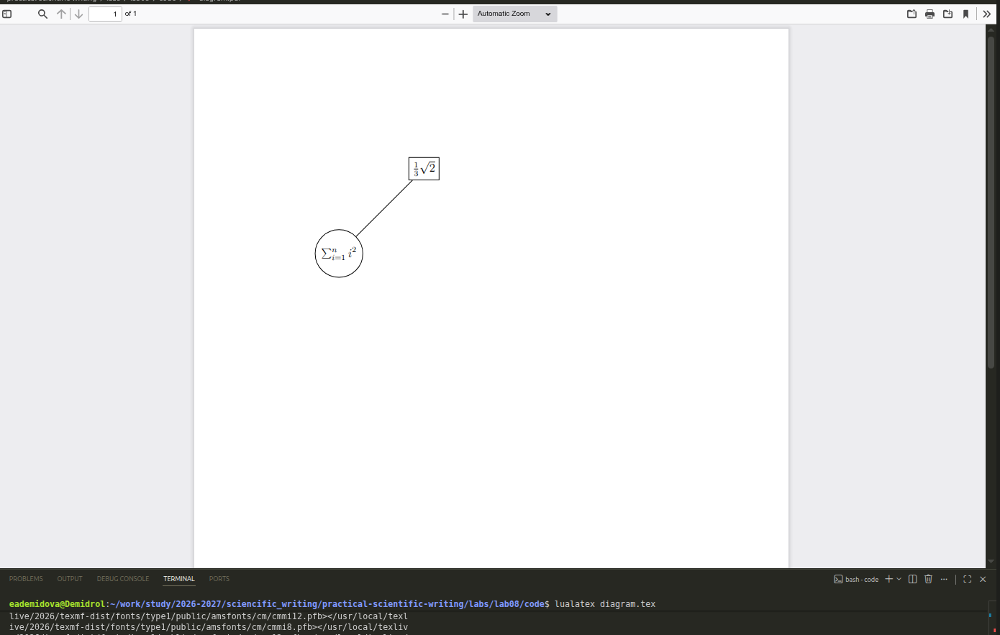

---
## Author
author:
  name: Демидова Екатерина Алексеевна
  degrees: BSc
  orcid: 0000-0002-0877-6063
  email: 1032259377@rudn.ru
  affiliation:
    - name: Российский университет дружбы народов
      country: Российская Федерация
      postal-code: 117198
      city: Москва
      address: ул. Миклухо-Маклая, д. 6
## Title
title: "Лабораторная работа №8"
subtitle: "Diagrams and drawings as code"
license: "CC BY"
date: today
date-format: "YYYY-MM-DD" # Example: 2025-09-06
---

# Цель работы

В ходе лабораторной работы требовалось освоить создание графических объектов в LaTeX с использованием пакета TikZ, включая рисование линий, кривых, узлов, построение графиков функций и применение циклов.

# Задание

1. Изучить базовые команды TikZ для создания рисунков: координаты, линии, кривые.
2. Освоить использование узлов (nodes) для подписей и оформления.
3. Научиться строить графики функций с помощью команды `plot`.
4. Изучить применение циклов `\foreach` для автоматизации построений.
5. Освоить стилизацию линий (цвет, толщина, тип) и использование различных форм узлов.

# Ход выполнения работы

## Базовое рисование линий

{#fig-01 width=60%}

## Различные стили линий

{#fig-02 width=60%}

## Кривые линии

{#fig-03 width=60%}

## Узлы (nodes)

{#fig-04 width=60%}

## Узлы (nodes)

{#fig-05 width=60%}

## Узлы (nodes)

{#fig-06 width=60%}

## Узлы (nodes)

{#fig-07 width=60%}

## Построение графиков функций

{#fig-08 width=60%}

## Построение графиков функций

{#fig-9 width=60%}

## Использование циклов

{#fig-10 width=60%}

## Использование циклов

{#fig-11 width=60%}

## Сложный пример: граф с узлами и линиями

{#fig-12 width=60%}

# Выводы

В ходе выполнения лабораторной работы были освоены:

- создание рисунков с помощью пакета TikZ: использование координат, команды `\draw`, стилей линий (цвет, толщина, тип стрелок);
- рисование прямых и кривых линий, включая кривые Безье;
- работа с узлами (`node`) для размещения текста и математических формул, оформление узлов рамками;
- построение графиков функций с помощью команды `plot` с настройкой области определения, количества точек и стиля линии;
- применение циклов `\foreach` для автоматизации построения повторяющихся элементов;
- комбинирование всех изученных элементов для создания сложных иллюстраций (графов, фракталов).

# Список литературы

1. American Mathematical Society. Why Do We Recommend LaTeX? — URL: https://www.ams.org/publications/authors/tex/latexbenefits ; Рекомендации AMS по использованию LaTeX2e. AMS Publications.
2. Lamport L. LaTeX: A Document Preparation System. — 1986. — Первое руководство по LaTeX.
3. LaTeX Project. An introduction to LaTeX. — URL: https://www.latex-project.org/about/ ; Дата обращения: 05.07.2026. Официальный сайт LaTeX.
4. Wikipedia. LaTeX. — URL: https://en.wikipedia.org/wiki/LaTeX ; Общая информация о системе LaTeX. Wikipedia, The Free Encyclopedia.