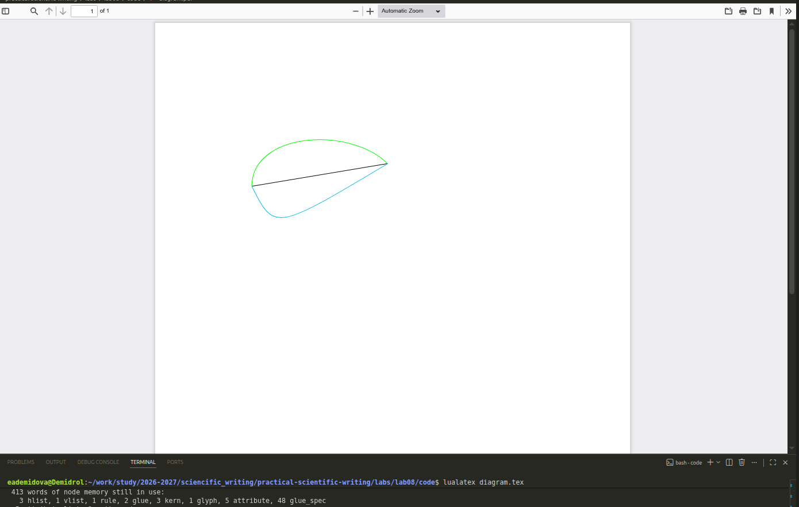
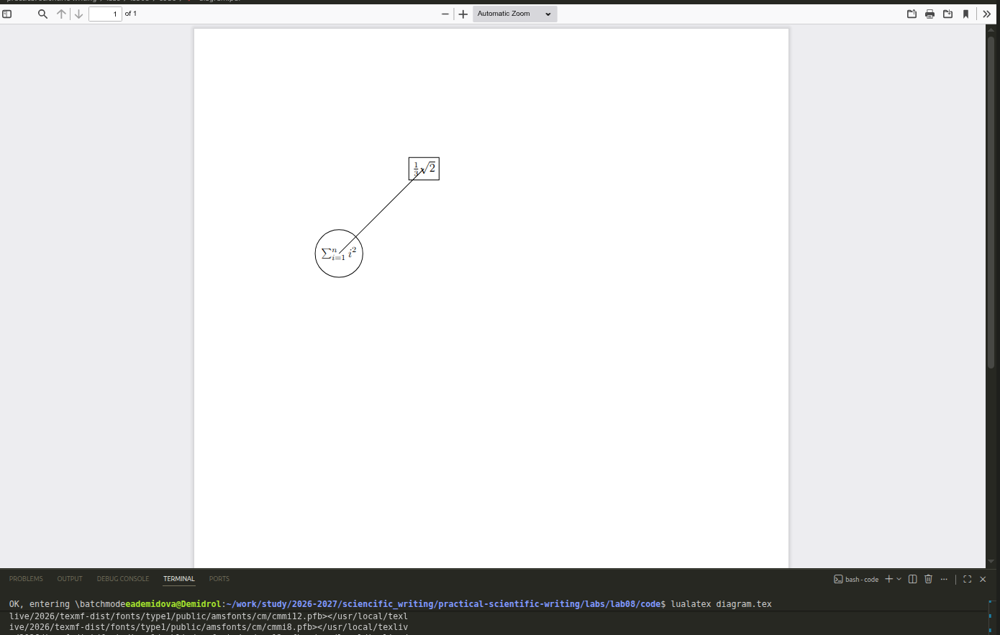
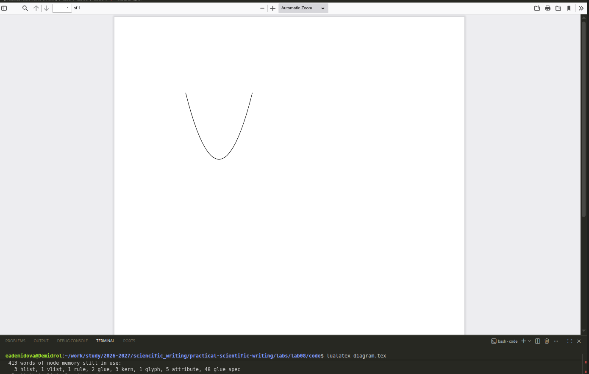
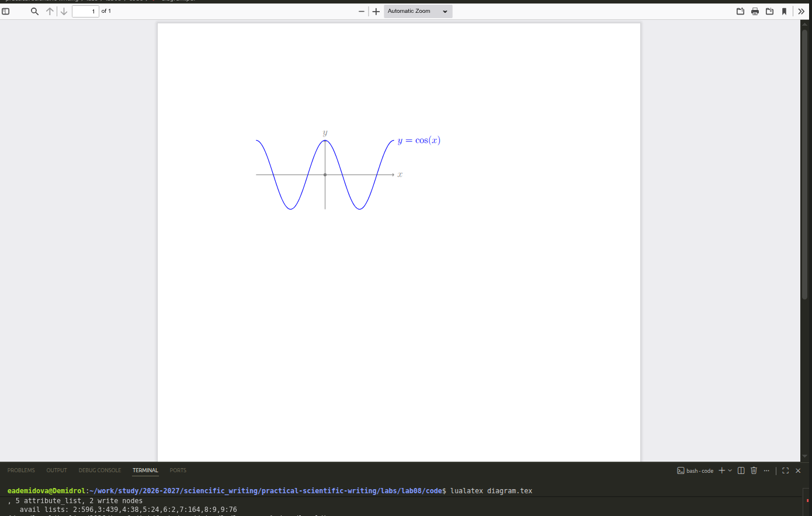
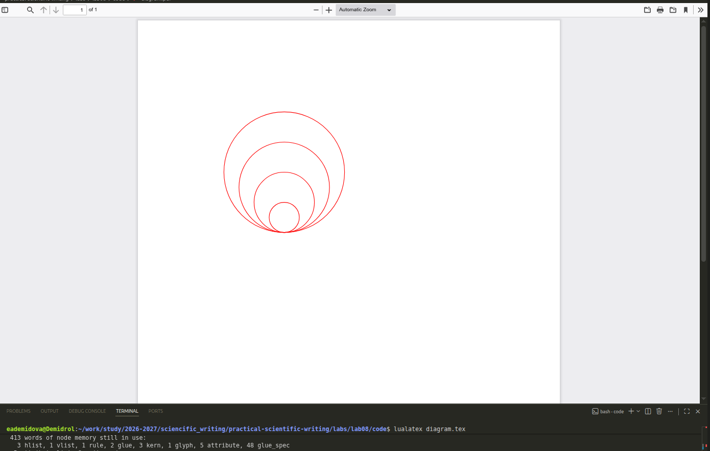
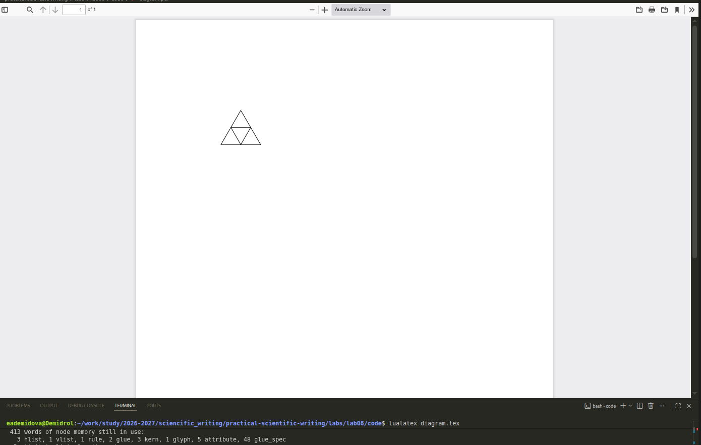
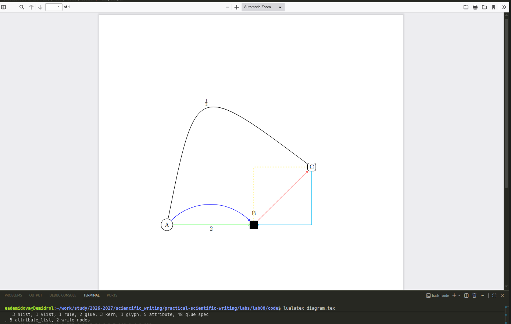

---
## Author
author:
  name: Демидова Екатерина Алексеевна
  degrees: BSc
  orcid: 0000-0002-0877-7063
  email: 1032259377@rudn.ru
  affiliation:
    - name: Российский университет дружбы народов
      country: Российская Федерация
      postal-code: 117198
      city: Москва
      address: ул. Миклухо-Маклая, д. 6

## Title
title: "Лабораторная работа №8"
subtitle: "Diagrams and drawings as code"
license: "CC BY"
---

# Цель работы

В ходе лабораторной работы требовалось освоить создание графических объектов в LaTeX с использованием пакета TikZ, включая рисование линий, кривых, узлов, построение графиков функций и применение циклов.

# Задание

1. Изучить базовые команды TikZ для создания рисунков: координаты, линии, кривые.
2. Освоить использование узлов (nodes) для подписей и оформления.
3. Научиться строить графики функций с помощью команды `plot`.
4. Изучить применение циклов `\foreach` для автоматизации построений.
5. Освоить стилизацию линий (цвет, толщина, тип) и использование различных форм узлов.

# Теоретическое введение

**LaTeX** — это система подготовки документов высокого типографского качества, построенная на основе языка разметки TeX. В отличие от текстовых процессоров (WYSIWYG), LaTeX использует описательную разметку: автор пишет текстовый файл с командами, определяющими структуру документа, а затем запускает компиляцию для получения готового PDF или DVI. Такой подход обеспечивает разделение содержания и оформления, позволяя сосредоточиться на логике документа, а не на его внешнем виде [@latex_project_intro].

LaTeX был разработан в начале 1980‑х годов **Лесли Лампортом** (Leslie Lamport) в SRI International. Лампорт создал набор макросов для TeX, который затем вырос в полноценную систему. В 1986 году вышло первое руководство пользователя, быстро ставшее популярным. С 1989 года развитие LaTeX перешло к команде под руководством Франка Миттельбаха, а в 1994 году была выпущена стабильная версия **LaTeX2e**, которая используется и сегодня [@lamport_latex_1986; @wikipedia_latex].

Главный принцип LaTeX — **логическая разметка**: автор использует команды типа `\chapter`, `\section`, `\table`, `\figure`, а система сама определяет, как эти элементы должны выглядеть в финальном документе. Это избавляет автора от ручного форматирования и делает документ единообразным. Кроме того, LaTeX обеспечивает автоматическую генерацию оглавлений, списков иллюстраций, перекрёстных ссылок и библиографий, что особенно важно для больших научных работ [@ams_latex_benefits].

Среди основных достоинств LaTeX выделяют:

- **стабильность и предсказуемость** вёрстки;
- **высокое качество** математических формул и типографики;
- **поддержка** крупных проектов с множеством файлов;
- **лёгкость** обмена и совместной работы (исходные файлы — обычный текст);
- **обширная экосистема** пакетов, расширяющих функциональность [@latex_project_intro; @ams_latex_benefits].

Американское математическое общество (AMS) рекомендует LaTeX для подготовки математических публикаций именно благодаря этим качествам [@ams_latex_benefits].

LaTeX широко используется в академической среде — для статей, диссертаций, книг, презентаций, а также в технической документации. Благодаря модульности он остаётся актуальным и сегодня, постоянно обновляясь (последние версии выходят ежегодно). Подробнее об истории и возможностях системы можно прочитать в открытых источниках [@wikipedia_latex].

# Ход выполнения работы

## Базовое рисование линий

Начнём с простого примера: рисуем ломаную линию между тремя точками ([рис. @fig-01]):

```tex
\documentclass[a4paper,12pt]{article}
\usepackage[T1]{fontenc}
\usepackage{tikz}

\begin{document}

\begin{tikzpicture}
\draw (-1,0) -- (3,10pt) -- (35:3);
\end{tikzpicture}

\end{document}
```

{#fig-01 width=70%}

Здесь использованы декартовы координаты `(-1,0)` и `(3,10pt)`, а также полярная `(35:3)` (угол 35°, радиус 3 см). Команда `--` соединяет точки прямыми отрезками.

## Различные стили линий

Изменим стиль линий: добавим стрелку, цвет и тип линии ([рис. @fig-02]):

```tex
\documentclass[a4paper,12pt]{article}
\usepackage[T1]{fontenc}
\usepackage{tikz}

\begin{document}

\begin{tikzpicture}
\draw[->] (-1,0) -| (3,10pt);
\draw[red] (3,10pt) -- (35:3);
\end{tikzpicture}

\end{document}
```

{#fig-02 width=70%}

Опция `->` добавляет стрелку в конце, `red` задаёт красный цвет. Команда `-|` рисует линию, идущую сначала горизонтально, затем вертикально (или наоборот).

## Кривые линии

TikZ поддерживает различные способы рисования кривых ([рис. @fig-03]):

```tex
\documentclass[a4paper,12pt]{article}
\usepackage[T1]{fontenc}
\usepackage{tikz}

\begin{document}

\begin{tikzpicture}
\draw (-1,0) to (5,1);
\draw[green] (-1,0) to[out=90,in=135] (5,1);
\draw[cyan] (-1,0) .. controls (0,-2) .. (5,1);
\end{tikzpicture}

\end{document}
```

{#fig-03 width=70%}

- Первая линия — прямая (`to`).
- Зелёная кривая использует опции `out=90` (выход под углом 90°) и `in=135` (вход под углом 135°).
- Голубая кривая — кривая Безье с одной контрольной точкой `(0,-2)`.

## Узлы (nodes)

Узлы позволяют размещать текст и оформлять его рамками ([рис. @fig-04]):

```tex
\documentclass[a4paper,12pt]{article}
\usepackage[T1]{fontenc}
\usepackage{tikz}

\begin{document}

\begin{tikzpicture}[scale=3]
\draw (0,0) node {hello} -- (1,1) node {world};
\end{tikzpicture}

\end{document}
```

{#fig-04 width=70%}

Узлы можно размещать в середине линии, сверху и т.д. ([рис. @fig-05]):

```tex
\documentclass[a4paper,12pt]{article}
\usepackage[T1]{fontenc}
\usepackage{tikz}

\begin{document}

\begin{tikzpicture}[scale=3]
\draw (0,0) -- (1,1) node [midway] {A} node [pos=0.75,above] {B} -- node [right] {C};
\end{tikzpicture}

\end{document}
```

{#fig-05 width=70%}

Узлы могут содержать математические формулы и иметь рамки ([рис. @fig-06]):

```tex
\documentclass[a4paper,12pt]{article}
\usepackage[T1]{fontenc}
\usepackage{tikz}

\begin{document}

\begin{tikzpicture}[scale=3]
\draw (0,0) node[circle,draw]{$\sum_{i=1}^n i^2$} -- (1,1) node[rectangle,draw]{$\frac{1}{3}\sqrt{2}$};
\end{tikzpicture}

\end{document}
```

{#fig-06 width=70%}

Чтобы линия соединяла центры узлов, нужно определить узлы отдельно ([рис. @fig-07]):

```tex
\documentclass[a4paper,12pt]{article}
\usepackage[T1]{fontenc}
\usepackage{tikz}

\begin{document}

\begin{tikzpicture}[scale=3]
\node[circle,draw] (label1) at (0,0) {$\sum_{i=1}^n i^2$};
\node[rectangle,draw] (label2) at (1,1) {$\frac{1}{3}\sqrt{2}$};
\draw (label1) -- (label2);
\end{tikzpicture}

\end{document}
```

{#fig-07 width=70%}

## Построение графиков функций

TikZ позволяет строить графики функций с помощью команды `plot` ([рис. @fig-08]):

```tex
\documentclass[a4paper,12pt]{article}
\usepackage[T1]{fontenc}
\usepackage{tikz}

\begin{document}

\begin{tikzpicture}
\draw [domain=-2:2] plot (\x, {pow(\x,2)});
\end{tikzpicture}

\end{document}
```

{#fig-08 width=70%}

Добавим оси и подписи, построим график косинуса ([рис. @fig-09]):

```tex
\documentclass[a4paper,12pt]{article}
\usepackage[T1]{fontenc}
\usepackage{tikz}

\begin{document}

\begin{tikzpicture}[scale=1.5]
% Оси
\draw[gray,->](-2,0)--(2,0) node[right]{$x$};
\draw[gray,->](0,-1)--(0,1) node[above]{$y$};
\draw[fill,gray](0,0) circle [radius=1pt];
% График
\draw[blue,thick,domain=-2:2,samples=150] plot (\x, {cos(pi*\x r)}) node[right]{$y=\cos(x)$};
\end{tikzpicture}

\end{document}
```

{#fig-9 width=70%}

Обратите внимание на `r` в аргументе косинуса — это указание, что угол задан в радианах.

## Использование циклов

Циклы `\foreach` позволяют создавать повторяющиеся элементы ([рис. @fig-10]):

```tex
\documentclass[a4paper,12pt]{article}
\usepackage[T1]{fontenc}
\usepackage{tikz}

\begin{document}

\begin{tikzpicture}[scale=0.75]
\foreach \x in {0,1,2,3}
  \draw[red,thick] (0,\x) circle [radius=\x+1];
\end{tikzpicture}

\end{document}
```

{#fig-10 width=70%}

Более сложный пример — треугольник Серпинского (первая итерация) ([рис. @fig-11]):

```tex
\documentclass[a4paper,12pt]{article}
\usepackage[T1]{fontenc}
\usepackage{tikz}

\begin{document}

\begin{tikzpicture}
\draw (0,0) -- (2,0) -- (1,{sqrt(3)}) -- cycle;
\draw (0.5,{sqrt(3)/2}) -- (1.5,{sqrt(3)/2}) -- (1,0) -- cycle;
\end{tikzpicture}

\end{document}
```

{#fig-11 width=70%}

Для полноценного фрактала требуется рекурсия, но в рамках этого отчёта мы ограничимся демонстрацией идеи.

## Сложный пример: граф с узлами и линиями

Создадим граф, подобный приведённому в методическом материале ([рис. @fig-12]):

```tex
\documentclass[a4paper,12pt]{article}
\usepackage[T1]{fontenc}
\usepackage{tikz}

\begin{document}

\begin{tikzpicture}[scale=2]
% Узлы
\node[circle,draw] at (0,0) (a) {A};
\node[rectangle,fill] at (3,0) (b) {B};
\node at (3,0.4) (blabel) {B};
\node[rectangle,rounded corners,draw] at (5,2) (c) {C};
% Линии
\draw[->,green] (a) -- (b) node[midway,below,black] {2};
\draw[->,blue] (a) to[out=45,in=135] (b);
\draw[->,red] (b) -- (c);
\draw[yellow,dotted,very thick] (b) |- (c);
\draw[<-,cyan] (b) -| (c);
\draw[thick,black] (a) .. controls (1,5) .. (c) node[midway,above] {$\frac{1}{2}$};
\end{tikzpicture}

\end{document}
```

{#fig-12 width=70%}

# Выводы

В ходе выполнения лабораторной работы были освоены:

- создание рисунков с помощью пакета TikZ: использование координат, команды `\draw`, стилей линий (цвет, толщина, тип стрелок);
- рисование прямых и кривых линий, включая кривые Безье;
- работа с узлами (`node`) для размещения текста и математических формул, оформление узлов рамками;
- построение графиков функций с помощью команды `plot` с настройкой области определения, количества точек и стиля линии;
- применение циклов `\foreach` для автоматизации построения повторяющихся элементов;
- комбинирование всех изученных элементов для создания сложных иллюстраций (графов, фракталов).

# Список литературы{.unnumbered}

::: {#refs}
:::